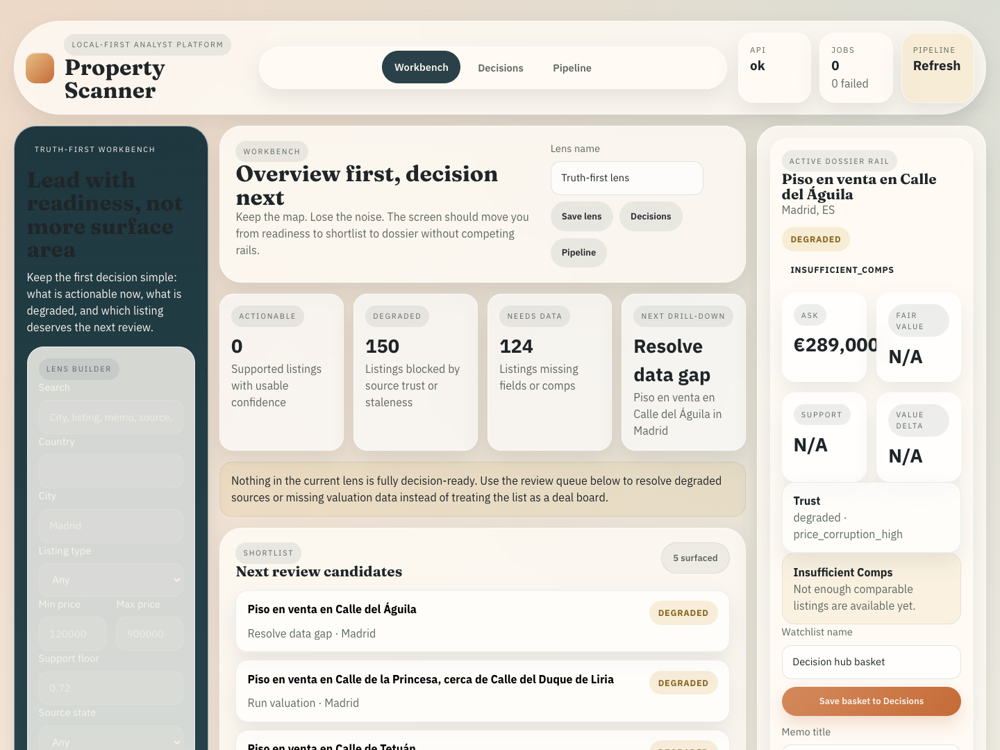
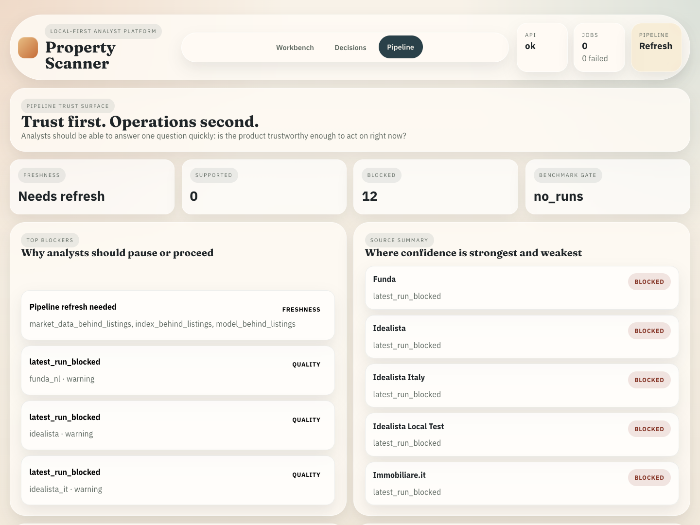
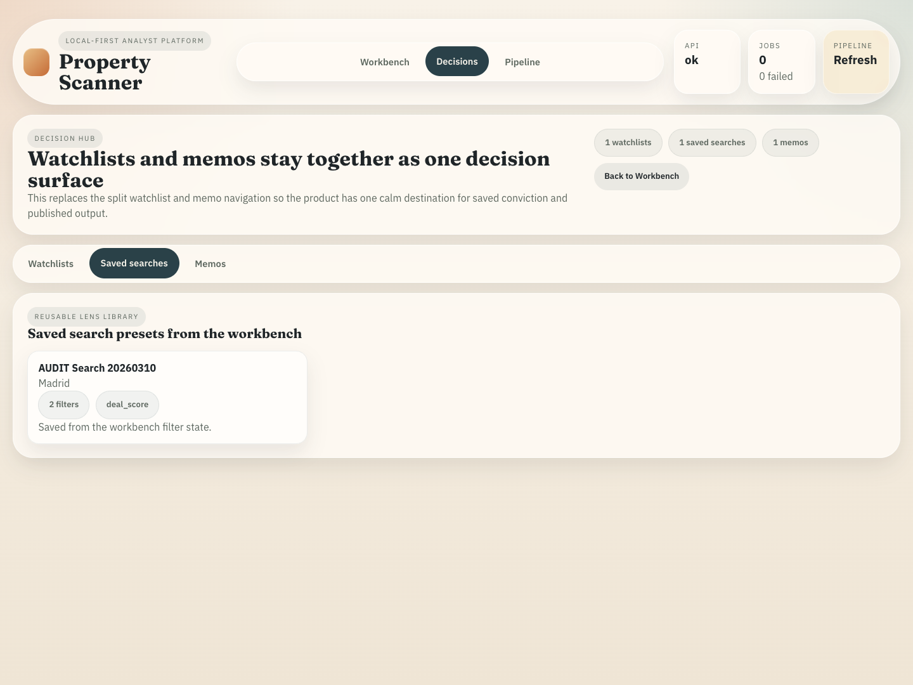

<p align="center">
  
</p>

# Property Scanner

Local-first property intelligence for teams that want valuations backed by
comps, provenance, and explicit pipeline readiness.

<p align="center">
  <a href="./docs/INDEX.md"><strong>Docs</strong></a>
  ·
  <a href="./docs/getting_started/quickstart.md"><strong>Quickstart</strong></a>
  ·
  <a href="./docs/reference/cli.md"><strong>CLI</strong></a>
  ·
  <a href="./docs/explanation/problem_landscape_and_solution.md"><strong>Why It Exists</strong></a>
  ·
  <a href="./docs/crawler_status.md"><strong>Crawler Status</strong></a>
</p>

<table>
  <tr>
    <td width="33%">
      
    </td>
    <td width="33%">
      
    </td>
    <td width="33%">
      
    </td>
  </tr>
  <tr>
    <td valign="top">
      <strong>Workbench</strong><br />
      Explore live inventory, inspect support, and open a full dossier without
      leaving the local stack.
    </td>
    <td valign="top">
      <strong>Pipeline trust</strong><br />
      See freshness gaps, blocked sources, and operational blockers before they
      leak into the valuation call.
    </td>
    <td valign="top">
      <strong>Decision hub</strong><br />
      Keep watchlists, memos, and reusable saved searches in the same system
      that serves the valuation evidence.
    </td>
  </tr>
</table>

## What it is

Property Scanner ingests noisy listing feeds, normalizes them locally, builds
market and retrieval artifacts, and serves evidence-carrying valuations through
a FastAPI API, a React workbench, and a CLI. The design goal is simple: expose
uncertainty, source health, and freshness instead of hiding them behind a clean
number.

## What ships

- React workbench for exploration, dossiers, comp review, pipeline trust,
  memos, watchlists, and saved searches
- FastAPI local API for health, listings, valuations, jobs, reports, and
  workbench data
- CLI workflows for preflight, crawling, market data, indexing, backfill, and
  serving audits

## Quickstart

```bash
python3 -m venv .venv
source .venv/bin/activate
python3 -m pip install --upgrade pip
python3 -m pip install -r requirements.lock
python3 -m pip install -e .
python3 -m playwright install

python3 -m src.interfaces.cli seed-sample-data
make smoke-api
property-scanner api --host 127.0.0.1 --port 8001
```

Open:

- Workbench: `http://127.0.0.1:8001/workbench`
- Pipeline trust: `http://127.0.0.1:8001/pipeline`
- API: `http://127.0.0.1:8001/api/v1/...`

`make smoke-api` verifies the local golden path:

- `GET /api/v1/health`
- `GET /api/v1/listings`
- `POST /api/v1/valuations`

## Operating model

- The React workbench is the primary UI.
- The deterministic local demo baseline is `pisos`.
- Other configured portals may still show up as blocked, degraded, or
  experimental on the local stack.
- Training and benchmark commands are readiness-gated and fail loudly when the
  data is not good enough.

## High-value commands

```bash
python3 -m src.interfaces.cli preflight --skip-transactions
python3 -m src.interfaces.cli build-index --listing-type sale
python3 -m src.interfaces.cli backfill --listing-type sale --max-age-days 7
python3 -m src.interfaces.cli audit-serving-data
make test-offline
```

## Repo map

- `src/interfaces/` - CLI, API, and legacy dashboard entrypoints
- `frontend/` - React workbench
- `src/listings/` - crawling, normalization, and persistence
- `src/market/` - market data, hedonic indices, and analytics
- `src/valuation/` - retrieval, valuation, calibration, and backfill
- `src/ml/` - training, fusion, benchmarks, and research implementation work
- `src/platform/` - storage, migrations, pipeline state, and shared runtime
- `docs/` - explanation, how-to, reference, and implementation records

## Notes

- The legacy Streamlit dashboard still exists as a fallback surface:

```bash
python3 -m src.interfaces.cli legacy-dashboard --skip-preflight
```

- There is no top-level license file in this repository.
