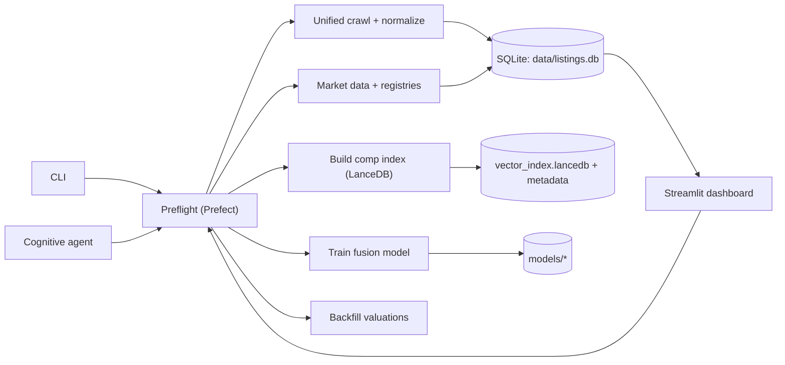

# Property Scanner (The Scout V2)

Local-first, agentic property intelligence: crawl listings, enrich them with market + multimodal signals, and produce valuations you can explore in a Streamlit dashboard.

For: building a repeatable pipeline for deal discovery, comp retrieval/indexing, training, and valuation workflows on your own machine (SQLite by default).

Quick Links: [Docs](./docs/00_docs_index.md) | [Dashboard](./src/interfaces/dashboard/app.py) | [CLI](./src/interfaces/cli.py) | [Config](./config/app.yaml) | [Crawler status](./docs/crawler_status.md)

---

## What It Does

- Crawls listings (multi-source) and normalizes them into a canonical schema.
- Runs enrichment and optional LLM/VLM feature fusion (via Ollama + LiteLLM fallbacks).
- Builds market data artifacts and a comp retriever index (LanceDB).
- Trains a fusion model and backfills valuations.
- Exposes everything via the Streamlit dashboard (`./src/interfaces/dashboard/app.py`), CLI (`./src/interfaces/cli.py`), and Python API (`./src/interfaces/api/pipeline.py`).

---

## Quickstart

### 1) Run the dashboard (local)

Prereqs:
- Python 3.10+
- Playwright browsers (needed for `html_browser` sources)

```bash
python3 -m venv .venv
source .venv/bin/activate

pip install -r requirements.txt
python3 -m playwright install

python3 -m src.interfaces.cli dashboard
```

Open Streamlit at: `http://localhost:8501`

Notes:
- `dashboard` runs a `preflight` refresh first. To skip: `python3 -m src.interfaces.cli dashboard --skip-preflight`
- Convenience script: `./run_dashboard.sh` (kills port `8501` then launches the dashboard)

<details>
<summary>Install with Poetry (optional)</summary>

```bash
poetry install --no-root
poetry run python -m playwright install
poetry run python -m src.interfaces.cli dashboard
```

</details>

### 2) Run with Docker Compose (dashboard on :8505)

```bash
docker compose up --build dashboard
```

Open Streamlit at: `http://localhost:8505`

Note: Compose mounts the repo into the container (`.:/app`), so the dashboard reads/writes `./data/` and `./models/` from your working tree by default.

---

## CLI Usage

The CLI is a thin wrapper around the real modules. Start here:

```bash
python3 -m src.interfaces.cli -h
```

Common commands:

```bash
python3 -m src.interfaces.cli preflight
python3 -m src.interfaces.cli unified-crawl --source rightmove_uk --search-url "<SEARCH_URL>" --max-pages 1
python3 -m src.interfaces.cli market-data
python3 -m src.interfaces.cli build-index --listing-type sale
python3 -m src.interfaces.cli train --epochs 50
python3 -m src.interfaces.cli backfill --listing-type sale --max-age-days 7
python3 -m src.interfaces.cli calibrators --input "<samples.jsonl>"
python3 -m src.interfaces.cli migrate
```

Run the cognitive agent:

```bash
python3 -m src.interfaces.cli agent "Find undervalued apartments in Madrid" "/venta-viviendas/madrid/centro/"
python3 -m src.interfaces.cli agent "Find investment opportunities in Barcelona" "https://www.pisos.com/venta/pisos-barcelona/"
```

---

## Configuration

Config is Hydra-composed from `./config/app.yaml` and the files it includes. Most edits happen in:

- `./config/sources.yaml` (enabled sources + templates + rate limits)
- `./config/valuation.yaml` (retriever + valuation policy)
- `./config/llm.yaml` and `./config/vlm.yaml` (LLM/VLM defaults)
- `./config/paths.yaml` (where DB/models/index live)

Environment variable overrides (from `./config/paths.yaml`):

| Variable | Default |
| --- | --- |
| `PROPERTY_SCANNER_DATA_DIR` | `./data` |
| `PROPERTY_SCANNER_MODELS_DIR` | `./models` |
| `PROPERTY_SCANNER_DB_PATH` | `./data/listings.db` |
| `PROPERTY_SCANNER_DB_URL` | `sqlite:///...` |
| `PROPERTY_SCANNER_VECTOR_INDEX_PATH` | `./data/vector_index.lancedb` |
| `PROPERTY_SCANNER_VECTOR_METADATA_PATH` | `./data/vector_metadata.json` |
| `PROPERTY_SCANNER_LANCEDB_PATH` | `./data/vector_index.lancedb` |

Other runtime knobs:
- `PROPERTY_SCANNER_TEXT_DEVICE` (used by embedding/encoder code paths)

---

## Data & Artifacts

By default the system of record is SQLite plus a few on-disk artifacts:

- `./data/listings.db` (listings + derived tables + `pipeline_runs`/`agent_runs`)
- `./data/unified_seen_urls.sqlite3` (URL de-dupe for unified crawl)
- `./data/vector_index.lancedb` and `./data/vector_metadata.json` (comp retriever index + metadata)
- `./models/` (model artifacts, e.g. `fusion_model.pt`, `calibration_registry.json`)

Deep dive: `./docs/02_data_pipeline.md`

---

## Crawling Notes (Read This First)

> [!WARNING]
> Many real-estate portals employ aggressive anti-bot protections. Live crawling reliability varies by source and may require additional infrastructure.

Status and blocking analysis: `./docs/crawler_status.md`

If you want a small, local harness (crawl + normalize with optional fusion, without running the full pipeline), use:

```bash
python3 scripts/source_harness.py --source rightmove_uk --search-url "<SEARCH_URL>" --output data/rightmove.jsonl --jsonl
```

---

## Python API

The CLI/dashboard sit on top of `PipelineAPI`:

```python
from src.interfaces.api import PipelineAPI

api = PipelineAPI()
api.preflight()
api.crawl_backfill(max_pages=1)
api.build_market_data()
api.build_vector_index(listing_type="sale")
analysis = api.evaluate_listing_id("listing-id", persist=True)
```

Source: `./src/interfaces/api/pipeline.py`

---

## Development

### Tests

By default, integration/e2e/live suites are opt-in (see `./tests/conftest.py`).

```bash
pytest
pytest --run-integration -m integration
pytest --run-e2e -m e2e
pytest --run-live -m live
```

### Prefect (optional)

You can run flows locally without a server, but a server adds run history and a UI:

```bash
prefect server start
python3 -m src.interfaces.cli preflight
python3 -m src.interfaces.cli prefect deploy
prefect agent start -q default
```

---

## Project Layout

- `./src/interfaces/`: CLI, dashboard, and public API
- `./src/listings/`: crawlers, normalizers, listing workflows
- `./src/market/`: transactions + market/hedonic/macro workflows
- `./src/valuation/`: retrieval, valuation, calibration, backfill
- `./src/ml/`: models, encoders, training
- `./src/platform/`: config, storage, migrations, pipeline state/runs
- `./docs/`: architecture and operational docs
- `./scripts/`: harnesses and debug tools

---

## Architecture (deep dive)

See `./docs/01_system_overview.md` for the full system map and data domains.

<details>
<summary>Mermaid system map</summary>



</details>

---

## Contributing

No `CONTRIBUTING.md` yet. If you want to contribute:

- Open an issue describing the target change (source, workflow, model, UI).
- Include reproduction steps (commands + config) and relevant logs.
- Add/adjust tests under `./tests/` where practical.

---

## License

No top-level license file is present in this repository.

---

## TODO (missing project metadata)

- Add a top-level license file (e.g. `./LICENSE`) and state the intended license in this README.
- Add `CONTRIBUTING.md` with contribution workflow and code quality expectations.
