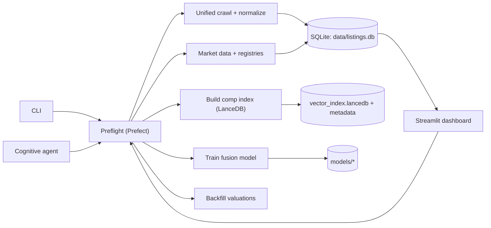

# Property Scanner (The Scout V2)

<p align="left">
  
</p>

Local-first property intelligence: crawl listings, enrich them with market + multimodal signals, and produce valuations you can explore in the React workbench served by the local FastAPI app.

For: building a repeatable pipeline for deal discovery, comp retrieval/indexing, training, and valuation workflows on your own machine (SQLite by default).

Quick Links: [Docs](./docs/INDEX.md) | [CLI](./src/interfaces/cli.py) | [Config](./config/app.yaml) | [Crawler status](./docs/crawler_status.md)

---

## What It Does

- Crawls listings (multi-source) and normalizes them into a canonical schema.
- Runs enrichment and optional LLM/VLM feature fusion (ChatMock/OpenAI-compatible by default; Ollama remains opt-in compatibility mode).
- Builds market data artifacts and a comp retriever index (LanceDB remains available, but is no longer the canonical production retrieval default).
- Writes analytical artifacts under `data/analytics/` as Parquet + JSON metadata for benchmark and quality snapshots.
- Keeps comparable-baseline valuations as the shipped prediction path today, while fusion training and benchmarking are explicit readiness-gated workflows that fail fast when sold-label data is insufficient.
- Exposes the product through the React workbench served by FastAPI, the CLI (`./src/interfaces/cli.py`), and the Python pipeline API (`./src/interfaces/api/pipeline.py`).

---

## Quickstart

### 1) Run the app (local)

Prereqs:
- Python 3.10+
- Playwright browsers (needed for `html_browser` sources)
- Node 22+ if you want to build or run the new `scraper/` Crawlee + Playwright sidecar
- ChatMock or another OpenAI-compatible endpoint running at `http://127.0.0.1:8000/v1` if you want default LLM/VLM enrichment

```bash
python3 -m venv .venv
source .venv/bin/activate

python3 -m pip install --upgrade pip
python3 -m pip install -r requirements.lock
python3 -m playwright install

python3 -m src.interfaces.cli api --host 127.0.0.1 --port 8001
```

Open the React workbench at: `http://127.0.0.1:8001/workbench`

Notes:
- Legacy Streamlit UI remains available only as a deprecated operator surface: `python3 -m src.interfaces.cli legacy-dashboard --skip-preflight`
- The JSON API now lives under `/api/v1/...`; browser routes remain clean SPA paths such as `/workbench`, `/watchlists`, and `/listings/<id>`.
- `python3 -m src.interfaces.cli audit-serving-data` now exports a source-quality snapshot to `data/analytics/quality/`.
- `python3 -m src.ml.training.train` and `python3 -m src.ml.training.benchmark` now fail fast with explicit readiness diagnostics; sale runs remain blocked until closed-sale label readiness is met.
- Set `CHATMOCK_API_KEY` only if your endpoint requires authentication; local ChatMock setups often do not.

<details>
<summary>Dependency lock policy (maintainers)</summary>

```bash
python3 -m pip install pip-tools
python3 -m piptools compile --resolver=backtracking --output-file requirements.lock requirements.txt
```

</details>

### 2) Run with Docker Compose (dashboard on :8505)

```bash
docker compose up --build dashboard
```

Open Streamlit at: `http://localhost:8505`

Note: Compose mounts the repo into the container (`.:/app`), so the dashboard reads/writes `./data/` and `./models/` from your working tree by default.

---

## CLI Usage

The CLI is a thin wrapper around the real modules. Start here:

```bash
python3 -m src.interfaces.cli -h
```

Common commands:

```bash
python3 -m src.interfaces.cli preflight --help
python3 -m src.interfaces.cli preflight
python3 -m src.interfaces.cli unified-crawl --source rightmove_uk --search-url "<SEARCH_URL>" --max-pages 1
python3 -m src.interfaces.cli market-data
python3 -m src.interfaces.cli build-index --listing-type sale
python3 -m src.interfaces.cli train --epochs 50
python3 -m src.interfaces.cli backfill --listing-type sale --max-age-days 7
python3 -m src.interfaces.cli calibrators --input "<samples.jsonl>"
python3 -m src.interfaces.cli migrate
```

For full Prefect flow-level flags, use:

```bash
python3 -m src.interfaces.cli prefect preflight --help
```

Run the cognitive agent:

```bash
python3 -m src.interfaces.cli agent "Find undervalued apartments in Madrid" "/venta-viviendas/madrid/centro/"
python3 -m src.interfaces.cli agent "Find investment opportunities in Barcelona" "https://www.pisos.com/venta/pisos-barcelona/"
```

---

## Configuration

Config is still Hydra-composed from `./config/app.yaml` for legacy modules, while the FastAPI/application runtime is driven by typed runtime settings in `config/runtime.yaml`. Most edits happen in:

- `./config/sources.yaml` (enabled sources + templates + rate limits)
- `./config/valuation.yaml` (retriever + valuation policy)
- `./config/llm.yaml`, `./config/description_analyst.yaml`, and `./config/vlm.yaml` (ChatMock/OpenAI-compatible defaults)
- `./config/paths.yaml` (where DB/models/index live)

Environment variable overrides (from `./config/paths.yaml`):

| Variable | Default |
| --- | --- |
| `PROPERTY_SCANNER_DATA_DIR` | `./data` |
| `PROPERTY_SCANNER_MODELS_DIR` | `./models` |
| `PROPERTY_SCANNER_DB_PATH` | `./data/listings.db` |
| `PROPERTY_SCANNER_DB_URL` | `sqlite:///...` |
| `PROPERTY_SCANNER_VECTOR_INDEX_PATH` | `./data/vector_index.lancedb` |
| `PROPERTY_SCANNER_VECTOR_METADATA_PATH` | `./data/vector_metadata.json` |
| `PROPERTY_SCANNER_LANCEDB_PATH` | `./data/vector_index.lancedb` |

Other runtime knobs:
- `PROPERTY_SCANNER_TEXT_DEVICE` (used by embedding/encoder code paths)
- `CHATMOCK_API_KEY` (optional auth for the default OpenAI-compatible backend)

---

## Data & Artifacts

By default the system of record is SQLite plus a few on-disk artifacts:

- `./data/listings.db` (listings + derived tables + `pipeline_runs`/`agent_runs`)
- `./data/unified_seen_urls.sqlite3` (URL de-dupe for unified crawl)
- `./data/vector_index.lancedb` and `./data/vector_metadata.json` (comp retriever index + metadata)
- `./models/` (model artifacts, e.g. `fusion_model.pt`, `calibration_registry.json`)
- `./data/analytics/` (Parquet + JSON metadata exports for benchmark datasets and source-quality audits)
- `./data/crawl_plans/`, `./data/crawl_results/`, `./data/crawl_snapshots/` (Python-to-sidecar scrape contract artifacts)

Deep dive: `./docs/explanation/data_pipeline.md`

---

## Crawling Notes (Read This First)

> [!WARNING]
> Many real-estate portals employ aggressive anti-bot protections. Live crawling reliability varies by source and may require additional infrastructure.

Status and blocking analysis: `./docs/crawler_status.md`

If you want a small, local harness (crawl + normalize with optional fusion, without running the full pipeline), use:

```bash
python3 scripts/source_harness.py --source rightmove_uk --search-url "<SEARCH_URL>" --output data/rightmove.jsonl --jsonl
```

---

## Python API

The CLI/dashboard sit on top of `PipelineAPI`:

```python
from src.interfaces.api import PipelineAPI

api = PipelineAPI()
api.preflight()
api.crawl_backfill(max_pages=1)
api.build_market_data()
api.build_vector_index(listing_type="sale")
analysis = api.evaluate_listing_id("listing-id", persist=True)
```

Source: `./src/interfaces/api/pipeline.py`

---

## Development

### Tests

By default, integration/e2e/live suites are opt-in (see `./tests/conftest.py`).

```bash
pytest
pytest --run-integration -m integration
pytest --run-e2e -m e2e
pytest --run-live -m live
```

### Prefect (optional)

You can run flows locally without a server, but a server adds run history and a UI:

```bash
prefect server start
python3 -m src.interfaces.cli preflight
python3 -m src.interfaces.cli prefect deploy
prefect agent start -q default
```

### Scraper sidecar (optional, new canonical browser-crawl direction)

The browser-heavy crawl path is moving toward the Node/TypeScript sidecar in `./scraper/`:

```bash
cd scraper
npm install
npm run build

python3 -m src.listings.scraping.sidecar \
  --source-id pisos \
  --start-url "https://example.com/search" \
  --write-only
```

That command writes a typed crawl plan into `data/crawl_plans/`; when run without `--write-only`, it invokes the sidecar and writes NDJSON fetch results plus raw HTML snapshots.

---

## Project Layout

- `./src/interfaces/`: CLI, dashboard, and public API
- `./src/listings/`: crawlers, normalizers, listing workflows
- `./src/market/`: transactions + market/hedonic/macro workflows
- `./src/valuation/`: retrieval, valuation, calibration, backfill
- `./src/ml/`: models, encoders, training
- `./src/platform/`: config, storage, migrations, pipeline state/runs
- `./docs/`: architecture and operational docs
- `./scripts/`: harnesses and debug tools

---

## Architecture (deep dive)

See `./docs/explanation/system_overview.md` for the full system map and data domains.

<details>
<summary>Mermaid system map</summary>



</details>

---

## Contributing

No `CONTRIBUTING.md` yet. If you want to contribute:

- Open an issue describing the target change (source, workflow, model, UI).
- Include reproduction steps (commands + config) and relevant logs.
- Add/adjust tests under `./tests/` where practical.

---

## License

No top-level license file is present in this repository.

---

## TODO (missing project metadata)

- Add a top-level license file (e.g. `./LICENSE`) and state the intended license in this README.
- Add `CONTRIBUTING.md` with contribution workflow and code quality expectations.
