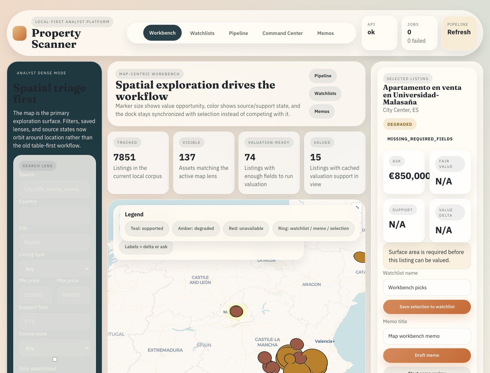

# Property Scanner

Local-first property intelligence for people who would like their valuation pipeline to contain both **math** and **evidence**, rather than just vibes.

[Docs](./docs/INDEX.md) | [Teaching doc](./docs/explanation/problem_landscape_and_solution.md) | [Quickstart](./docs/getting_started/quickstart.md) | [CLI reference](./docs/reference/cli.md) | [Crawler status](./docs/crawler_status.md)

## Why this exists

Residential property analysis is awkward in exactly the ways software dislikes:

- listings are noisy and incomplete,
- sources get blocked,
- markets drift over time,
- sold labels are sparse,
- and a neat point estimate can look much more trustworthy than it should.

Property Scanner exists to make that workflow explicit and local:

- crawl and normalize listings,
- build market and comparable-search context,
- generate evidence-carrying valuations,
- and surface the whole thing through a local API, CLI, and React workbench.

## A real look at the workbench



## What it does

- Crawls and normalizes listings from multiple configured portals.
- Tracks source health, blocked portals, and degraded data quality explicitly.
- Builds market/index artifacts and comparable-retrieval metadata.
- Produces comp-anchored valuations with interval semantics and persisted evidence.
- Exposes the workflow through:
  - the local FastAPI app,
  - the React workbench at `/workbench`,
  - the CLI in `src/interfaces/cli.py`.

## How it works in one minute

The short version:

1. ingest listings,
2. clean and validate them,
3. build market context and comparable-search artifacts,
4. estimate value relative to robust, time-adjusted comps,
5. expose the result with explicit readiness and uncertainty signals.

The long version lives here:

- [Property Scanner: Problem Landscape, Core Ideas, and How This Repository Solves It](./docs/explanation/problem_landscape_and_solution.md)

That page is the best place to start if you want to understand the *why*, not just the commands.

## Quickstart

### Prerequisites

- Python 3.10+
- `pip`
- Playwright browser binaries
- optional: Node 22+ if you want to build or run the secondary scraper sidecar

### Install

```bash
python3 -m venv .venv
source .venv/bin/activate

python3 -m pip install --upgrade pip
python3 -m pip install -r requirements.lock
python3 -m playwright install
```

### Verify the command surface

```bash
python3 -m src.interfaces.cli -h
python3 -m src.interfaces.cli preflight --help
```

### Run the primary app surface

```bash
python3 -m src.interfaces.cli api --host 127.0.0.1 --port 8001
```

Open:

- React workbench: `http://127.0.0.1:8001/workbench`
- JSON API: `http://127.0.0.1:8001/api/v1/...`

Notes:

- The React workbench is the current primary UI.
- The Streamlit dashboard is still available as a **legacy** surface:

```bash
python3 -m src.interfaces.cli legacy-dashboard --skip-preflight
```

## Common workflows

### Refresh stale artifacts

```bash
python3 -m src.interfaces.cli preflight --skip-transactions
```

### Run a targeted crawl

```bash
python3 -m src.interfaces.cli unified-crawl --source rightmove_uk --search-url "<SEARCH_URL>" --max-pages 1
```

### Build market and retrieval artifacts

```bash
python3 -m src.interfaces.cli market-data
python3 -m src.interfaces.cli build-index --listing-type sale
```

### Backfill valuations

```bash
python3 -m src.interfaces.cli backfill --listing-type sale --max-age-days 7
```

### Run the offline test gate

```bash
python3 -m pytest -m "not integration and not e2e and not live"
python3 -m pytest --run-integration -m integration
python3 -m pytest --run-e2e -m e2e
```

### Audit serving quality

```bash
python3 -m src.interfaces.cli audit-serving-data
```

That exports a source-quality snapshot under `data/analytics/quality/`.

## Project structure

- `src/interfaces/` — CLI, API, legacy dashboard entrypoints
- `frontend/` — React workbench
- `src/listings/` — crawling, normalization, quality gating, persistence
- `src/market/` — market data, hedonic indices, analytics
- `src/valuation/` — retrieval, valuation, calibration, backfill
- `src/ml/` — training, fusion services, retriever ablation, benchmarks
- `src/platform/` — storage, settings, migrations, pipeline state
- `docs/` — explanation, how-to, reference, manifest, and implementation docs

## Troubleshooting

### Port `8001` is already in use

Run the API on another port:

```bash
python3 -m src.interfaces.cli api --host 127.0.0.1 --port 8771
```

Then open `/workbench` on that port instead.

### Browser-driven scraping or UI automation fails

Install Playwright browsers:

```bash
python3 -m playwright install
```

### A source is present in config but not actually usable

That can be expected. Some portals are blocked, degraded, or experimental by design on the current local stack. Check:

- [Crawler status](./docs/crawler_status.md)
- pipeline status in the workbench or API

### Training or benchmark commands fail immediately

That is often intentional. Sale-model training and benchmarking are readiness-gated and currently require enough closed-sale labels. The repo prefers a loud failure over pretending the data is good enough.

## Read this next

- [Docs index](./docs/INDEX.md)
- [Teaching doc: problem landscape and solution](./docs/explanation/problem_landscape_and_solution.md)
- [Quickstart](./docs/getting_started/quickstart.md)
- [CLI reference](./docs/reference/cli.md)
- [System overview](./docs/explanation/system_overview.md)
- [Crawler status](./docs/crawler_status.md)

## Contributing

There is no top-level `CONTRIBUTING.md` yet.

Practical contribution rule: keep changes scoped, add tests when behavior changes, and keep the docs truthful. The repo has very little patience for fake success.

## License

No top-level license file is present in this repository.
