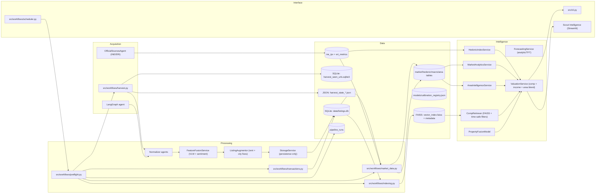

# System Architecture Overview

Property Scanner is a local-first pipeline that harvests listings, enriches them, and produces valuations, projections, and recommendations with strict data and freshness requirements.

## System Map

## Components in One Line Each
- Acquisition: `src/workflows/harvest.py`, plus LangGraph for agent-driven discovery and `OfficialSourcesAgent` for government stats.
- Processing: normalize, fuse VLM signals, ingest sold transactions, then persist via StorageService.
- Data: SQLite is the system of record; `pipeline_runs` records operational health.
- Intelligence: time-safe comps, hedonic indices, income-aware valuation, and area intelligence.
- Interface: CLI and the Scout Intelligence dashboard.
- Automation: scheduled preflight keeps data and artifacts fresh without manual runs.

## Module Boundaries (Contract)
- `src/agents/**`: crawling and normalization from raw sources to `CanonicalListing`.
- `src/workflows/**`: batch orchestration (harvest, market data, indexing, preflight).
- `src/repositories/**`: centralized data access; services do not execute raw SQL.
- `src/services/**`: valuation, retrieval, forecasting, and data augmentation.
- `src/api/**`: public pipeline + valuation API used by CLI/agent/dashboard.
- `src/cognitive/**`: LangGraph agent tools and orchestrator.
- `src/scripts/**`: thin wrappers for legacy entry points.
- `src/dashboard/**`: Streamlit UI.
