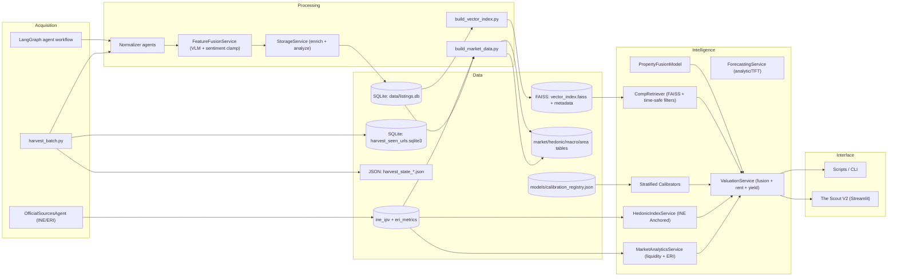

# System Architecture Overview

Property Scanner is a local-first pipeline that harvests listings, enriches them, and produces valuations, projections, and recommendations with strict data requirements.

## System Map

## Components in One Line Each
- Acquisition: bulk harvesting via `src/scripts/harvest_batch.py`, and `OfficialSourcesAgent` for government stats (INE/ERI).
- Processing: normalize, fuse VLM-derived signals, clamp sentiment, then persist via StorageService.
- Data: SQLite is the system of record. `ine_ipv` and `eri_metrics` form the official ground truth layer.
- Intelligence: time-safe comp retrieval, fusion valuation on log-residuals (anchored by INE indices), and calibrated uncertainty.
- Interface: "The Scout V2" Dashboard and CLI scripts.

## Module Boundaries (Contract)
- Agents (`src/agents/**`): crawling, normalization, and enrichment of raw source data into `CanonicalListing`.
- Services (`src/services/**`): storage, encoding, retrieval, valuation, forecasting, and model artifacts; no direct crawling.
- Scripts/CLI (`src/scripts/**`, `src/cli.py`): orchestration glue and user-facing entrypoints.
