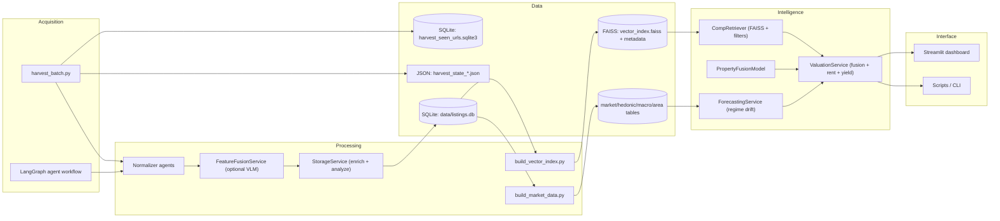

# System Architecture Overview

Property Scanner is a local-first pipeline that harvests listings, enriches them, and produces valuations, projections, and recommendations with strict data requirements.

## System Map

## Components in One Line Each
- Acquisition: bulk harvesting via `src/scripts/harvest_batch.py`, optional agent-driven flows via `src/cognitive/graph.py`.
- Processing: normalize, optionally fuse VLM-derived signals, then persist via StorageService.
- Data: SQLite is the system of record; vector index and derived indices are rebuildable artifacts.
- Intelligence: strict comp retrieval (geo + property_type + size), fusion valuation, regime drift projections, rent/yield integration.
- Interface: Streamlit dashboard and CLI scripts (build indices, vector index, backfill valuations, training).
