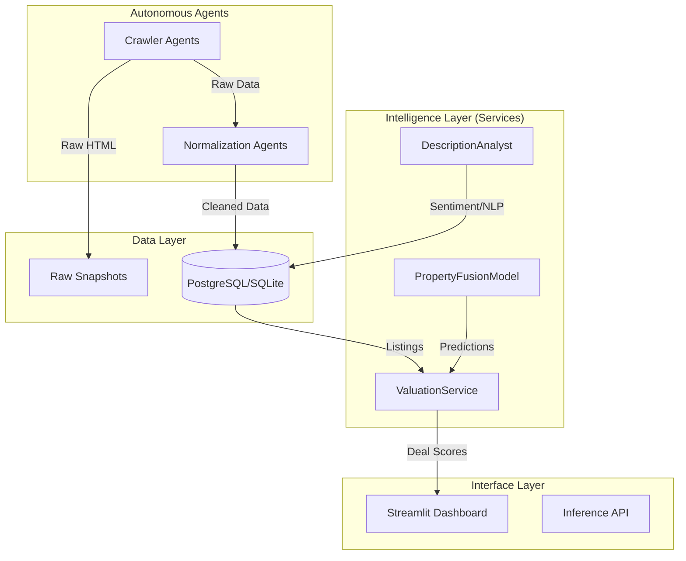

# System Architecture Overview

The **Property Scanner** is an autonomous AI system designed to find, analyze, and value real estate opportunities using a data-driven, multimodal approach.

## High-Level Architecture

The system operates in three main layers: **Data Ingestion**, **Intelligence**, and **Interface**.

## Key Components

### 1. Autonomous Agents
- **Crawlers**: Responsible for navigating real estate portals (e.g., Pisos.com) and extracting raw listing data.
- **Processors**: Normalize raw data into a canonical schema, handling currency conversion, unit standardization, and deduplication.

### 2. The AI Brain (`PropertyFusionModel`)
- A custom PyTorch model that reasons over **multimodal data**:
    - **Tabular**: Price, size, looking, floor level.
    - **Text**: Semantics from titles and descriptions.
    - **Vision**: Visual condition derived from property images.
- It uses **Cross-Attention** to compare a target property against a retrieval set of similar listings ("comparables") to determine market value.

### 3. Valuation & Strategy
- **ValuationService**: Orchestrates the valuation process. It fetches comparables, runs the Fusion Model, and applies business logic to calculate a "Deal Score".
- **Snapshot Storage**: Ensures reproducibility by saving immutable copies of every listing as it was seen at a point in time.

### 4. User Interface
- **Streamlit Dashboard**: A reactive UI for human-in-the-loop analysis. Allows users to filter deals, visualize market heatmaps, and inspect the AI's reasoning.
