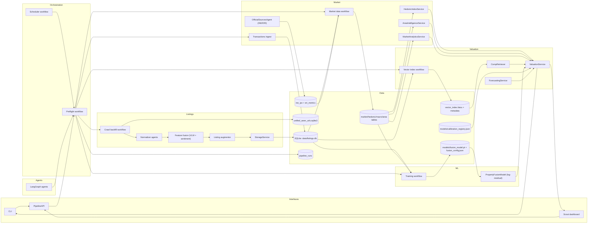

# System Architecture Overview

Property Scanner is a local-first pipeline that crawls listings, enriches them, and produces valuations, projections, and recommendations with strict data and freshness requirements.

## System Map

## System components at a glance
- Acquisition: Crawl backfill workflow plus LangGraph for agent-driven discovery and `OfficialSourcesAgent` for government stats.
- Processing: Normalize listings, fuse VLM signals, ingest sold transactions, then persist via StorageService.
- Data: SQLite is the system of record; `pipeline_runs` tracks operational health.
- Intelligence: Time-safe comps with metadata locks, hedonic indices, income-aware valuation, and area intelligence.
- Interfaces: CLI, PipelineAPI, and the Scout Intelligence dashboard.
- Automation: Scheduled preflight keeps data and artifacts fresh without manual runs.

## Module boundaries (what lives where)
- Interfaces: CLI, API, and dashboard entry points.
- Agents: LangGraph tools, the orchestrator, and analyst agents.
- Listings: Crawl/normalize/enrich listings, listing repos, crawl workflows.
- Market: Macro/indices/registry signals, market repos, market workflows.
- Valuation: Retrieval + valuation services, calibration/backfill/indexing workflows.
- ML: Models/encoders and training pipelines.
- Platform: Config/settings, storage + migrations, pipeline state/runs.
- Scripts: Workflow wrappers, crawl harnesses, and debug utilities.
