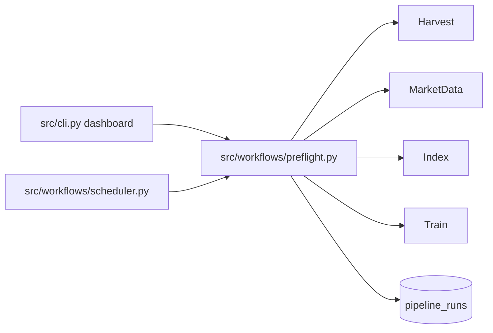
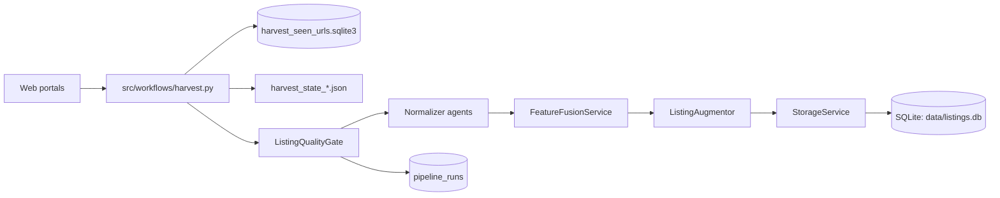
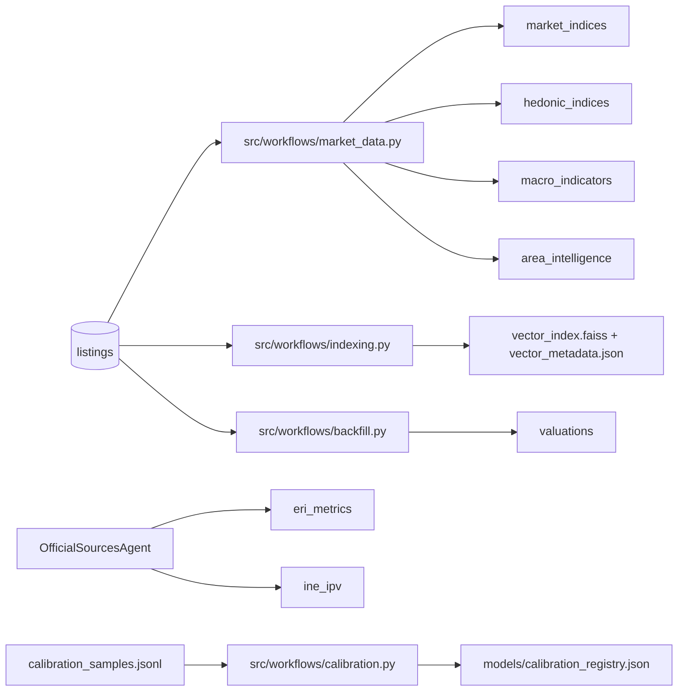
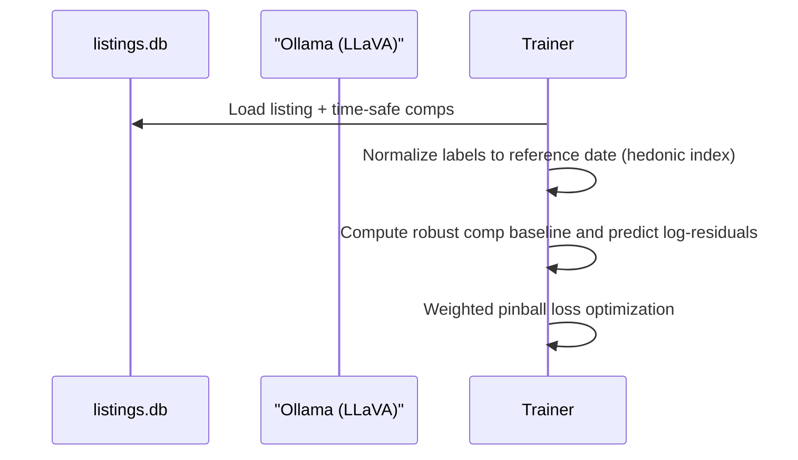

# Data and Training Pipeline

This document summarizes how listings flow through the system, how derived artifacts are produced, and how quality gates keep the lake clean.

## 0. Preflight (Default Path)

Preflight is the recommended way to run the pipeline. It checks freshness and runs only what is stale.

- `python3 -m src.cli dashboard` triggers preflight unless `--skip-preflight` is passed.
- `python3 -m src.cli schedule` runs preflight on an interval or cron schedule (canonical automation entry point).
- Preflight uses `PipelineStateService` to compare listing freshness against market data, index files, and model artifacts.

## 1. Ingestion (Harvester with Quality Gate)

- URL de-dupe and resume are handled by `SeenUrlStore` and `HarvestState`.
- Listings are validated before persistence. If invalid ratio exceeds threshold, the harvest halts.

## 2. Derived Data and Caches

Recommended order (manual path):
1) Harvest + normalize + store
2) Build market data (macro + indices)
3) Build vector index
4) Train fusion model
5) Backfill valuations
6) Update calibration registry

## 3. Quality Gates and Run Logs

- **ListingQualityGate** rejects listings missing price, surface area, or title.
- If invalid ratio exceeds the configured threshold, the pipeline stops.
- Every workflow run is recorded in `pipeline_runs` with metadata, including sample failures.

## 4. Data Assets (On Disk)

| Artifact | Purpose | Produced by | Notes |
| --- | --- | --- | --- |
| `data/listings.db` (listings) | Primary dataset | `StorageService` | System of record |
| `data/listings.db` (market/hedonic) | Derived indices | `market_data.py` | Market + hedonic indices |
| `data/listings.db` (ine_ipv) | Official stats | `OfficialSourcesAgent` | Benchmark anchors |
| `data/listings.db` (eri_metrics) | Registral stats | `OfficialSourcesAgent` | Liquidity signals |
| `data/listings.db` (pipeline_runs) | Operational logs | `PipelineRunTracker` | Run metadata |
| `data/vector_index.faiss` | Dense comp index | `indexing.py` | Required for comps |
| `data/vector_metadata.json` | Comp metadata | `indexing.py` | Encoder + policy lock |
| `data/harvest_seen_urls.sqlite3` | URL de-dupe | `SeenUrlStore` | Safe to delete to re-crawl |
| `data/harvest_state_*.json` | Resume state | `HarvestState` | Safe to delete to restart |
| `data/harvest_urls_*.json` | URL checkpoint | Harvester | Optional safety net |
| `models/fusion_model.pt` | Trained fusion model | `src/training/train.py` | Required for valuation |
| `models/fusion_config.json` | Fusion model config | `src/training/train.py` | Required for valuation |
| `models/calibration_registry.json` | Conformal calibrators | `src/workflows/calibration.py` | Optional |

## 5. Multimodal Training (Short View)

- VLM descriptions are stored in `vlm_description` and treated as extra text.
- Comp selection is time-safe and deduped; retriever mode freezes the encoder + VLM policy for train/infer parity.
- Valuation is strict: comps, indices, and model artifacts must exist or the evaluation fails.
