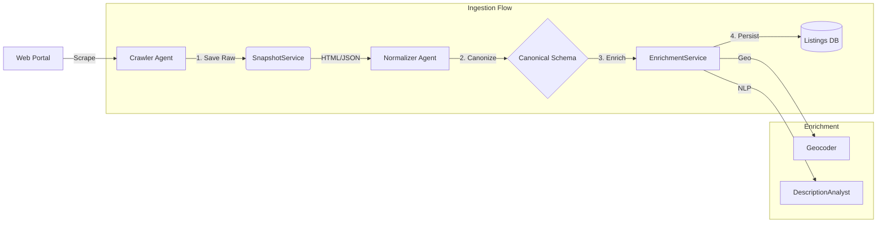
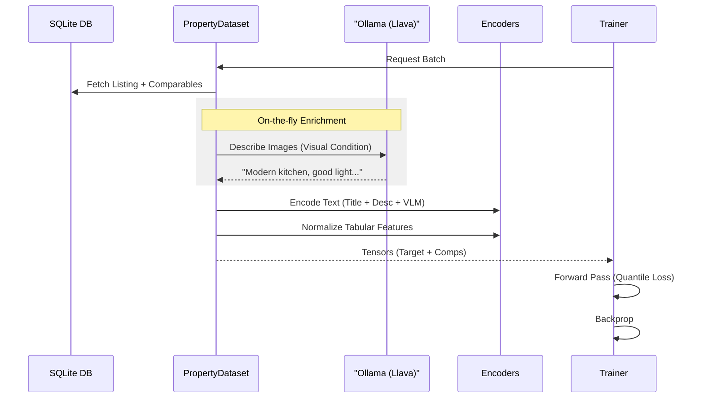

# Data & Training Pipeline

This document details how raw web data is transformed into a high-quality dataset and used to train the valuation model.

## 1. Data Ingestion Pipeline

The ingestion process focuses on **robustness** and **reproducibility**. We do not just scrape data; we archive the world state.

### Key Services
- **`SnapshotService`**: Saves raw HTML with metadata (`source_id`, `timestamp`). Allows re-parsing if schemas change.
- **`EnrichmentService`**: Fills gaps in data (e.g., missing city names) using heuristics and external APIs.
- **`DescriptionAnalyst`**: Uses lightweight NLP to extract sentiment scores and key facts (e.g., "needs renovation") from descriptions.

---

## 2. Multimodal Training Pipeline

The training pipeline prepares data for the `PropertyFusionModel`. It is unique because it handles text, images, and tabular data simultaneously.

### Dataset Logic (`PropertyDataset`)
- **Comparison-Based**: The model is never shown a listing in isolation. It always sees:
  - **Target Listing**: The property to value.
  - **Context Set**: 5 comparable listings from the same city/neighborhood.
- **VLM Integration**: We use a vision-language model (Llava) to "read" images and convert them into textual descriptions of condition and quality, which are then embedded with the listing description. This avoids the high computational cost of processing raw images during training.
