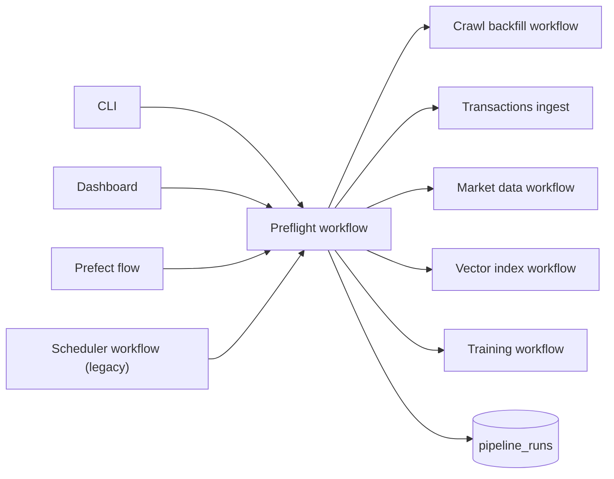
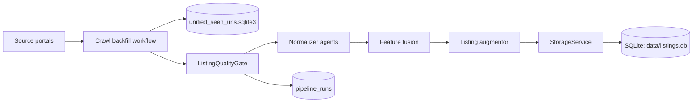
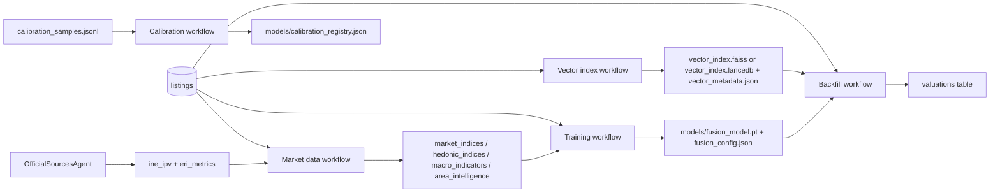
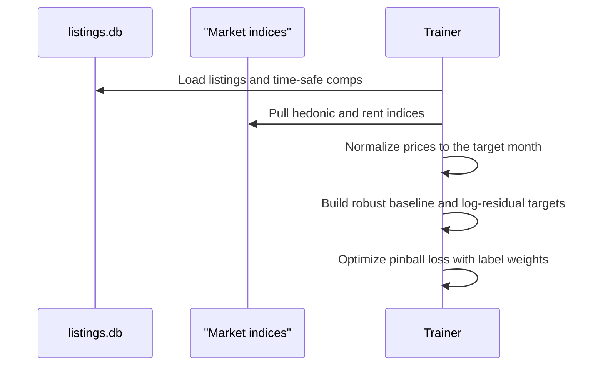

# Data and Training Pipeline

This document summarizes how listings flow through the system, how derived artifacts are produced, and how quality gates keep the lake clean.

## 0. Start here: preflight

Preflight is the simplest way to run the pipeline. It checks freshness and only runs what is stale.



- `python3 -m src.interfaces.cli dashboard` triggers preflight unless `--skip-preflight` is passed.
- `python3 -m src.interfaces.cli prefect preflight` runs preflight as a Prefect flow with retries and task-level caching.
- `python3 -m src.interfaces.cli schedule` runs preflight on an interval or cron schedule (legacy APScheduler path).
- Preflight uses `PipelineStateService` to compare listing freshness against market data, index files, and model artifacts.
- Preflight ingests transactions from config defaults unless `--skip-transactions` is set; `--transactions-path` overrides the default. Transactions run before market data and training.
- Set `dataframe.backend: polars` to enable Polars aggregation for market indices.
  
Prefect UI: run `prefect server start` and then launch the flow to get run history, retries, and task logs.

## 1. Ingestion: crawl backfill with quality gates



- URL de-dupe is handled by `SeenUrlStore`.
- Listings are validated before persistence. If the invalid ratio exceeds the threshold, the crawl stops.

## 1.5 Transactions: sold/registry ingest

```
python3 -m src.interfaces.cli transactions -- --path data/transactions.csv
```

- The transactions workflow ingests sold price and sold date updates.
- Records are matched by `listing_id`, `(source_id, external_id)`, or `url`.
- `status`, `sold_price`, and `sold_at` are updated so downstream training and valuation use ground-truth sales.

## 2. Derived data and caches



Recommended manual order:
1) Crawl backfill + normalize + store
2) Ingest transactions (sold/registry data)
3) Build market data (macro + indices)
4) Build vector index (FAISS or LanceDB)
5) Train fusion model
6) Backfill valuations
7) Update calibration registry

LanceDB option: `python3 -m src.interfaces.cli build-index -- --backend lancedb`.

## 3. Quality gates and run logs

- **ListingQualityGate** rejects listings missing price, surface area, or title.
- If invalid ratio exceeds the configured threshold, the pipeline stops.
- Every workflow run is recorded in `pipeline_runs` with metadata, including sample failures.

## 4. Data assets on disk

| Artifact | Purpose | Produced by | Notes |
| --- | --- | --- | --- |
| `data/listings.db` (listings) | Primary dataset | `StorageService` | System of record |
| `data/listings.db` (market/hedonic) | Derived indices | Market data workflow | Market + hedonic indices |
| `data/listings.db` (ine_ipv) | Official stats | `OfficialSourcesAgent` | Benchmark anchors |
| `data/listings.db` (eri_metrics) | Registral stats | `OfficialSourcesAgent` | Liquidity signals |
| `data/listings.db` (pipeline_runs) | Operational logs | `PipelineRunTracker` | Run metadata |
| `data/vector_index.faiss` | Dense comp index (FAISS) | Indexing workflow | Required for comps |
| `data/vector_index.lancedb` | Dense comp index (LanceDB) | Indexing workflow | Required for comps |
| `data/vector_metadata.json` | Comp metadata | Indexing workflow | Encoder + policy lock |
| `data/unified_seen_urls.sqlite3` | URL de-dupe | `SeenUrlStore` | Safe to delete to re-crawl |
| `models/fusion_model.pt` | Trained fusion model | Training workflow | Required for valuation |
| `models/fusion_config.json` | Fusion model config | Training workflow | Required for valuation |
| `models/comp_cache.json` | Comp cache (optional) | Training workflow | Persisted comps when using retriever |
| `models/calibration_registry.json` | Conformal calibrators | Calibration workflow | Optional |

## 5. Multimodal training at a glance



- VLM descriptions are stored in `vlm_description` and treated as extra text.
- Comp selection is time-safe and deduped; retriever mode freezes the encoder + VLM policy and can persist comp IDs for train/infer parity.
- Time+geo splits are available (`--split-strategy time_geo`) to reduce leakage.
- Valuation is strict: if comps, indices, or model artifacts are missing, evaluation stops rather than guessing.
