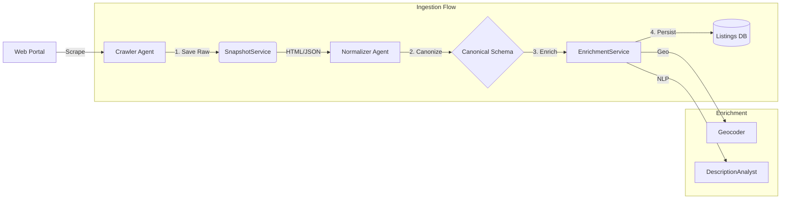
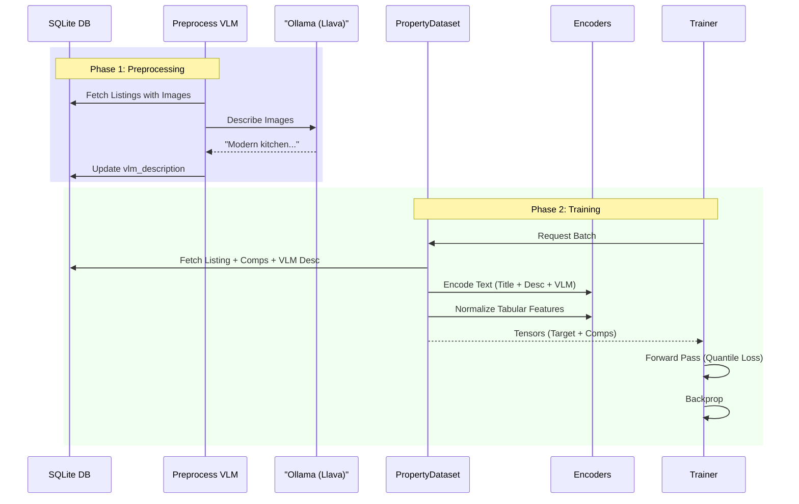

# Data & Training Pipeline

This document details how raw web data is transformed into a high-quality dataset and used to train the valuation model.

## 1. Data Ingestion Pipeline

The ingestion process focuses on **robustness** and **reproducibility**. We do not just scrape data; we archive the world state.

### Key Services
- **`SnapshotService`**: Saves raw HTML with metadata (`source_id`, `timestamp`). Allows re-parsing if schemas change.
- **`EnrichmentService`**: Fills gaps in data (e.g., missing city names) using heuristics and external APIs.
- **`DescriptionAnalyst`**: Uses lightweight NLP to extract sentiment scores and key facts (e.g., "needs renovation") from descriptions.

---

## 2. Multimodal Training Pipeline

The training pipeline prepares data for the `PropertyFusionModel`. It is unique because it handles text, images, and tabular data simultaneously.

The VLM enrichment is decoupled from the training loop to improve efficiency. It runs as a preprocessing step (`src/training/preprocess_vlm.py`), storing generated descriptions in the database.

### Dataset Logic (`PropertyDataset`)
- **Comparison-Based**: The model is never shown a listing in isolation. It always sees:
  - **Target Listing**: The property to value.
  - **Context Set**: 5 comparable listings from the same city/neighborhood.
- **VLM Integration**: The dataset loads pre-computed VLM descriptions from the database (`vlm_description` column). This textual description is concatenated with the listing's title and description before embedding, allowing the model to "see" the condition of the property without needing to process images during training.
