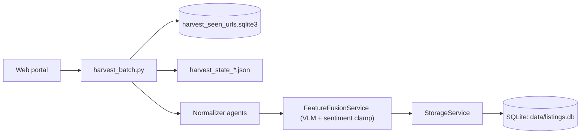
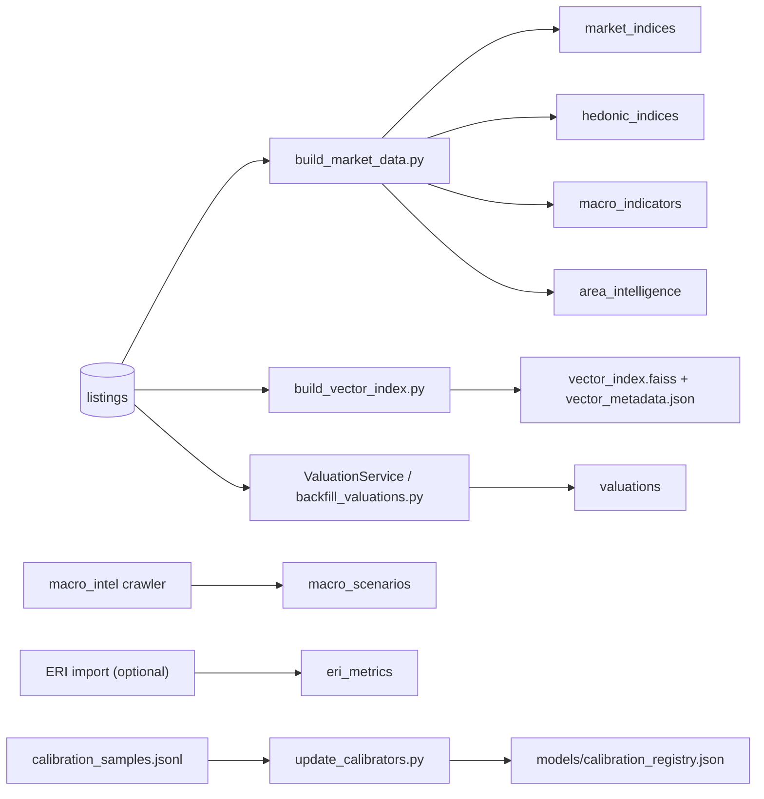
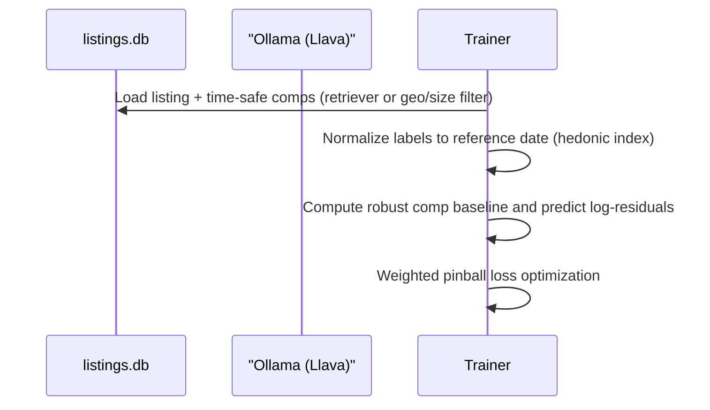

# Data and Training Pipeline

This document summarizes how listings flow through the system and how data is managed on disk.

## 1. Ingestion (Batch Harvester)

- URL de-dupe and resume are handled by `SeenUrlStore` and `HarvestState`.
- Listings are upserted into `listings` with enrichment and analysis during save.

## 2. Derived Data and Caches

Recommended order (strict):
1) Harvest + normalize + store
2) Build market indices (and load ERI metrics if available)
3) Build vector index (encoder + VLM policy locked)
4) Train fusion model (time-safe comps + log-residual targets)
5) Run valuations / backfill
6) Update calibration registry from out-of-sample results

## 3. Data Assets (On Disk)

| Artifact | Purpose | Produced by | Notes |
| --- | --- | --- | --- |
| `data/listings.db` (listings) | Primary dataset | `StorageService` | Core system of record |
| `data/listings.db` (market/hedonic) | Derived indices | `build_market_data.py` | Anchored by INE IPV |
| `data/listings.db` (ine_ipv) | Official Stats | `OfficialSourcesAgent` | Fallback anchor |
| `data/listings.db` (eri_metrics) | Registral Stats | `OfficialSourcesAgent` | Liquidity/Validation |
| `data/listings.db` (valuations) | Cached deal analyses | `ValuationService` or `backfill_valuations.py` | Rebuildable |
| `data/listings.db` (macro_scenarios) | Scenario forecasts | `macro_intel` crawler | Optional |
| `data/vector_index.faiss` | Dense comp index | `build_vector_index.py` | Required for comps |
| `data/vector_metadata.json` | Comp metadata | `build_vector_index.py` | Required for comps |
| `data/harvest_seen_urls.sqlite3` | URL de-dupe | `SeenUrlStore` | Safe to delete to re-crawl |
| `data/harvest_state_*.json` | Resume state | `HarvestState` | Safe to delete to restart |
| `data/harvest_urls_*.json` | URL checkpoint | Harvester | Optional safety net |
| `models/fusion_model.pt` | Trained fusion model | `src/training/train.py` | Required for valuation |
| `models/fusion_config.json` | Fusion model config | `src/training/train.py` | Required for valuation |
| `models/calibration_registry.json` | Stratified conformal calibrators | `src/scripts/update_calibrators.py` | Optional but recommended |

## 4. Multimodal Training (Short View)

- VLM descriptions are stored in `vlm_description`, gated/whitelisted, and then treated as extra text.
- Comp selection is time-safe and deduped; retriever mode freezes the encoder + VLM policy for train/infer parity.
- Valuations are strict: comps, indices, and model artifacts must exist or the evaluation fails.
- Train per listing_type; sale models should use `label_source=sold` so rental rows never leak into sale training.
