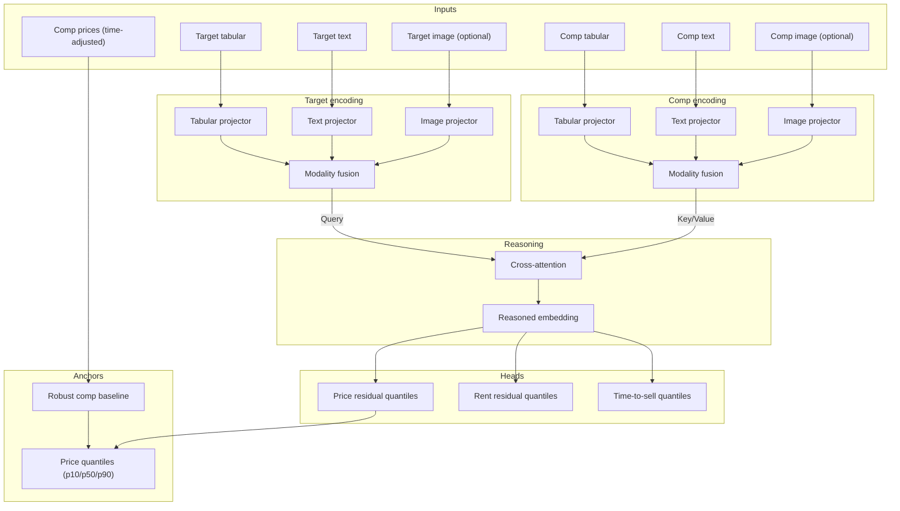
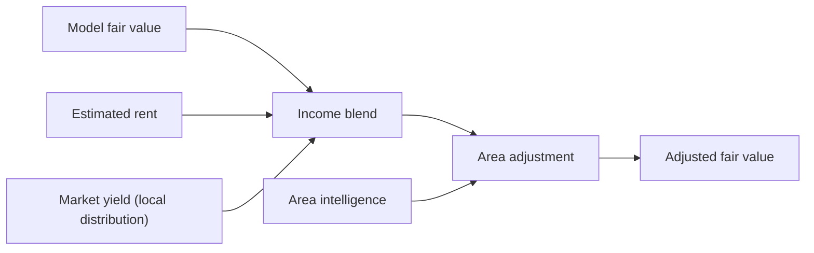

# PropertyFusionModel: how it works

PropertyFusionModel predicts fair value by comparing a target listing with its comps. It learns the residual over a comp baseline rather than raw price.

## Architecture diagram

## Key ideas

### 1. Cross-attention pricing
The model predicts price relative to the market:
- The target listing queries comparable listings.
- A robust comp baseline (MAD-filtered weighted median) is computed outside the model.
- The model predicts log-residuals over the baseline (`target_mode=log_residual`).
- Comp prices are time-adjusted (hedonic for sale, rent index for rent) before baseline/residual math.
- INE IPV anchors are used when local data is thin.

### 2. Quantile regression and uncertainty
The model outputs a distribution, not a single number:
- p10: conservative price
- p50: fair value
- p90: optimistic price

Weighted pinball loss trains the quantile heads and encodes label reliability.

### 3. Comparable selection is strict
- Comps are time-safe (comp date <= target date).
- Retriever metadata (encoder + VLM policy) must match across train and infer.
- Retriever mode can persist comp IDs to reduce train/infer drift.
- If comps or indices are missing, valuation fails instead of guessing.

### 4. Label strategy
- Sale training labels prefer `sold_price` when available; ask prices are a fallback.
- Rent training labels use asking rent and are normalized via the rent index.
- Label weights reflect reliability: sold > rent ask > sale ask.
- Training target is the log-residual: `log(target_adj) - log(baseline)`.

## How the system blends signals
The model output is combined with income and area intelligence signals:

- **Income blend** uses local yield distributions and weights by rent comp coverage/variance.
- **Area adjustment** nudges valuation using sentiment and development scores derived from official ERI/INE data, with freshness and credibility scaling.
- Evidence is recorded in `external_signals` for transparency.

## Current configuration
Defined in `fusion_model.py`.

| Parameter | Value | Description |
| --- | --- | --- |
| Tabular Dim | 11 | bedrooms, bathrooms, surface_area_sqm, year_built, floor, lat, lon, price_per_sqm (zeroed), text_sentiment, image_sentiment, has_elevator |
| Text Dim | 384 | SentenceTransformer embedding size |
| Image Dim | 512 | Optional image embedding size |
| Hidden Dim | 64 | Projection size |
| Heads | 2 | Attention heads |
| Parameters | ~92k | Lightweight, CPU-friendly |

## What you need to run it
- Model artifacts: `models/fusion_model.pt` and `models/fusion_config.json`.
- Vector index: `data/vector_index.faiss` + `data/vector_metadata.json`.
- Market tables in `data/listings.db`: `market_indices`, `hedonic_indices`, `macro_indicators`, `area_intelligence`.
- Optional calibrators: `models/calibration_registry.json`.
