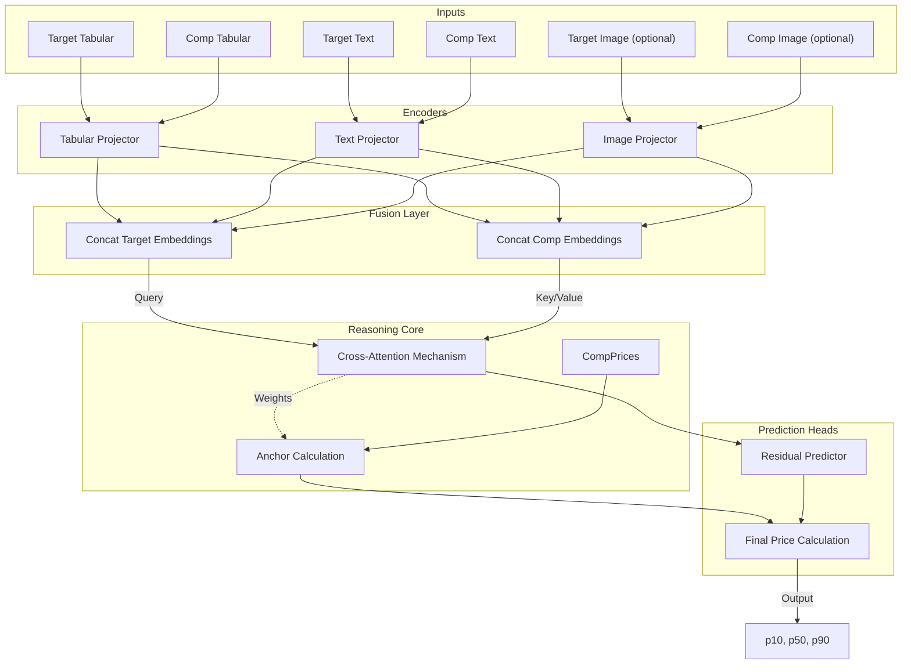

# Model Architecture: PropertyFusionModel

The **PropertyFusionModel** is the "brain" of the system. It uses an attention-based architecture to estimate the fair market value of a property by reasoning over its attributes and its relationship to the market.

## Architecture Diagram

## Core Concepts

### 0. Input Composition
- Text input is `title + description + vlm_description` (when available).
- Image embeddings are optional and used only if cached.

### 1. Cross-Attention Pricing
Traditional models predict price directly from features ($f(x) \rightarrow y$). Our model predicts price **relative to the market** ($f(x, \{comps\}) \rightarrow y$).
- The **Target Listing** queries the **Comparable Listings**.
- The model learns "how much better or worse" the target is compared to the comps.
- **Anchor Price**: The weighted average of comp prices (weighted by similarity).
- **Residual**: The model predicts a +/- adjustment to this anchor.

### 2. Quantile Regression (Uncertainty)
Real estate valuation is inherently uncertain. Instead of a single number, the model predicts a probability distribution:
- **p10 (Conservative)**: "Quick sale" price.
- **p50 (Fair)**: Probable market value.
- **p90 (Optimistic)**: High-end estimate.

This is achieved using **Pinball Loss** during training.

### 3. Strict Comparable Selection and Time Adjustment
- Comps are retrieved from a FAISS index with strict geo + property_type + size filters.
- Comp prices are time-adjusted via the hedonic index before fusion.
- If indices or comps are missing, valuation fails instead of falling back.

### 4. Hyperparameters (Current Configuration)
Defined in `src/services/fusion_model.py`.

| Parameter | Value | Description |
|-----------|-------|-------------|
| Tabular Dim | 11 | bedrooms, bathrooms, surface_area_sqm, year_built, floor, lat, lon, price_per_sqm, text_sentiment, image_sentiment, has_elevator |
| Text Dim | 384 | SentenceTransformer embedding size (includes VLM descriptions) |
| Image Dim | 512 | Optional image embedding size |
| Hidden Dim | 64 | Projection size (Compact for efficiency) |
| Heads | 2 | Attention heads |
| Parameters | ~92k | Lightweight, runs on CPU |

### 5. Runtime Requirements
- Model artifacts: `models/fusion_model.pt` and `models/fusion_config.json`.
- Vector index: `data/vector_index.faiss` + `data/vector_metadata.json`.
- Market/hedonic indices in `data/listings.db`.
