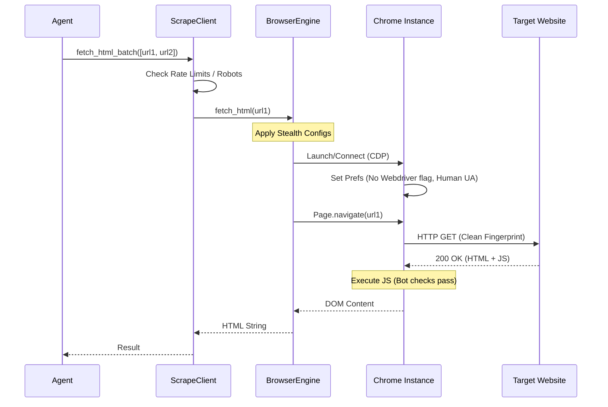

# Unified Scraping Architecture

## Overview

The **Unified Scraping Architecture** abstracts the complexity of fetching content from modern, protected websites. Agents interact with `ScrapeClient`, while the underlying browser engine is a Pydoll-powered `BrowserEngine` configured through `BrowserEngineConfig`.

### Core Design Philosophy
*   **Abstraction**: Agents (e.g., Idealista, Pisos) request *content*, not *browsers*.
*   **Resilience**: Retry-aware browser tasks with explicit recovery hooks.
*   **Stealth**: Centralized fingerprint controls via browser preferences and CDP options.
*   **Performance**: Concurrency control per batch with a shared browser instance.

---

## Architecture Diagram

```mermaid
graph TD
    A[Crawler Agent\n(e.g., Idealista, Rightmove)] -->|Request URLs| B(ScrapeClient)
    B -->|Check Compliance| C{ComplianceManager}
    C -- Allowed --> D[BrowserFetcher]
    C -- Blocked --> E[Wait / Skip]

    D -->|Async tasks| F[BrowserEngine (Pydoll/CDP)]
    F -->|Tabs/Contexts| G[Chrome Instance]
    G -->|CDP Commands| H[Target Website]
```

---

## Component Deep Dive

### 1. `ScrapeClient`
The high-level orchestrator used by all crawlers.
*   **Role**: Manages batching (`fetch_html_batch`), compliance checks, and per-source concurrency.
*   **Usage**: `client.fetch_html(url)` or `client.fetch_html_batch([urls])`.
*   **Config**: Accepts `browser_config` to override the browser engine for a source.

### 2. `BrowserFetcher`
Thin sync wrapper around the async browser engine.
*   **Role**: Binds `BrowserEngineConfig`, enforces a bounded semaphore, and bridges sync crawlers to async Pydoll.
*   **Behavior**: Throws if invoked inside an active event loop to avoid nested async usage.

### 3. `BrowserEngine` (Pydoll/CDP)
The primary browser engine used by `ScrapeClient`.

*   **Technology**: Direct Chrome DevTools Protocol (CDP) control via Pydoll.
*   **Stealth**:
    *   **`--headless=new`**: Modern headless mode.
    *   **AutomationControlled**: Disabled to hide `navigator.webdriver`.
    *   **Human prefs**: SafeBrowsing + search suggestions enabled; password prompts disabled.
*   **Speed**:
    *   **Preference tuning**: Disables plugins and network prediction; images remain enabled for stealth/VLM.
    *   **Batch reuse**: A single Chrome instance serves multiple tabs per batch.
*   **Scale**:
    *   **Contexts**: Optional browser contexts for isolation (`use_contexts`).
    *   **Remote**: `remote_ws_address` lets you attach to a remote Chrome.

### 4. `BrowserNetworkConfig`
Network control surfaces exposed to crawlers.
*   **Blocklist**: `block_resource_types`, `block_url_keywords`.
*   **Overrides**: `extra_headers` for header injection.
*   **Mocks**: `mock_responses` for deterministic fixtures.
*   **Monitoring**: `monitor_network` + `network_log_limit` for request/response traces.

---

## Pydoll Mechanics: How We Crawl

We emphasize **stealth via Pydoll**. Unlike standard Selenium/Playwright which often leak automation signals, Pydoll operates at the CDP layer and lets us tune both browser prefs and network behavior.

### Crawl Flow (Sequence)



### Key Optimizations
1.  **Retry orchestration**: Pydoll `@retry` with refresh hooks (`retry_max`, `retry_delay_s`).
2.  **Cloudflare bypass**: Optional CDP-based bypass via `cloudflare_bypass`.
3.  **Network shaping**: Block/monitor requests and inject headers via `BrowserNetworkConfig`.
4.  **Context isolation**: Optional per-task browser contexts (with proxy configs).

### Hybrid UI + API mode
For login-heavy sites, `BrowserEngine.run_hybrid` runs UI steps and then issues
API requests in the same session using `BrowserApiRequest`. This keeps cookies,
headers, and session state aligned while avoiding slow DOM scraping.

---

## Workflows

### Batch Ingestion (`unified_crawl.py`)
*   **Strategy**: "Wide and Shallow".
*   **Process**:
    1.  Loads a plan (List of sources/URLs).
    2.  Spins up `ScrapeClient` for each source.
    3.  Uses `BrowserEngine.fetch_many` to fetch N pages concurrently in a shared browser instance.
    4.  Aggregates results, deduplicates, and fuses data.

### Backfill Plans (`unified_crawl.py`)
*   **Strategy**: "Plan-driven and repeatable".
*   **Process**:
    1.  Define source + search URLs in a crawl plan JSON (or use enabled sources from config).
    2.  Run the unified crawler with `SeenUrlStore` de-dupe.
    3.  Normalize, fuse, and persist in the same pass.
