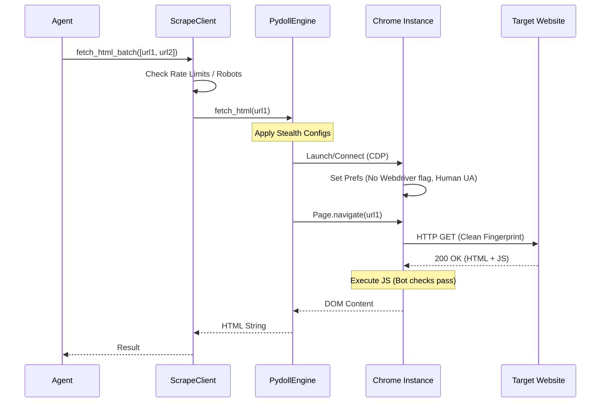

# Unified Scraping Architecture

## Overview

The **Unified Scraping Architecture** is designed to abstract the complexity of fetching content from modern, protected websites. It provides a single, consistent interface for agents (`ScrapeClient`) while managing the underlying `Pydoll` engine.

### Core Design Philosophy
*   **Abstraction**: Agents (e.g., Idealista, Pisos) request *content*, not *browsers*.
*   **Resilience**: Automatic retries and recovery strategies inside the browser engine.
*   **Stealth**: Centralized anti-fingerprinting and behavioral evasion.
*   **Performance**: Concurrency management and connection pooling.

---

## Architecture Diagram

```mermaid
graph TD
    A[Crawler Agent\n(e.g., Idealista, Rightmove)] -->|Request URLs| B(ScrapeClient)
    B -->|Check Compliance| C{ComplianceManager}
    C -- Allowed --> D[PydollEngine]
    C -- Blocked --> E[Wait / Skip]

    D -->|Connection Pool| F[Chrome Instances]
    F -->|CDP Commands| G[Target Website]
```

---

## Component Deep Dive

### 1. `ScrapeClient`
The high-level orchestrator used by all Agents.
*   **Role**: Manages batching (`fetch_html_batch`), concurrency limits, and compliance checks (Robots.txt, rate limits).
*   **Usage**: `client.fetch_html(url)` or `client.fetch_html_batch([urls])`.

### 2. `PydollEngine`
The primary browser engine used by `ScrapeClient`.

*   **Technology**: Direct Chrome DevTools Protocol (CDP) control.
*   **Stealth**:
    *   **`--headless=new`**: Modern headless mode.
    *   **`AutomationControlled`**: Flag disabled to hide `navigator.webdriver`.
    *   **Human Profile**: Adds human-like preferences (SafeBrowsing, Search Suggestions) to blend in.
*   **Speed**:
    *   **Resource Blocking**: Blocks plugins, fonts (configurable). *Images enabled by default for stealth/VLM compatibility.*
    *   **Connection Pooling**: Reuses browser instances for multiple requests, avoiding expensive startup costs.

---

## Pydoll Mechanics: How We Crawl

We emphasize **Stealth via Pydoll**. Unlike standard Selenium/Playwright which often leak "automation" signals, Pydoll operates at the network prototype layer.

### Crawl Flow (Sequence)



### Key Optimizations
1.  **Event-Driven**: We wait for specific network idle states or DOM content, not arbitrary sleep timers.
2.  **Fingerprint rotation**: Startups can rotate User-Agents and Viewport sizes.
3.  **Bypass logic**: Integrated Cloudflare/Antibot logic (via CDP overrides) handles common challenges automatically.

---

## Workflows

### Batch Ingestion (`unified_crawl.py`)
*   **Strategy**: "Wide and Shallow".
*   **Process**:
    1.  Loads a plan (List of sources/URLs).
    2.  Spins up `ScrapeClient` for each source.
    3.  Uses `PydollFetcher` with a thread pool to fetch N pages concurrently.
    4.  Aggregates results, deduplicates, and fuses data.

### Backfill Plans (`unified_crawl.py`)
*   **Strategy**: "Plan-driven and repeatable".
*   **Process**:
    1.  Define source + search URLs in a crawl plan JSON (or use enabled sources from config).
    2.  Run the unified crawler with `SeenUrlStore` de-dupe.
    3.  Normalize, fuse, and persist in the same pass.
