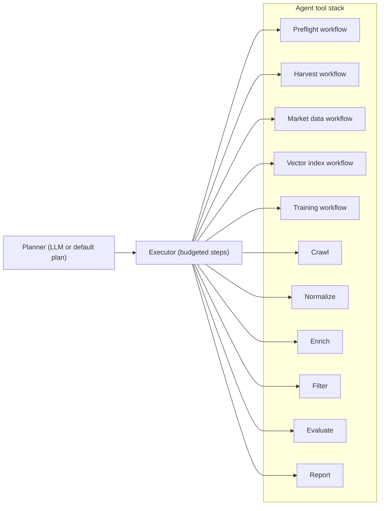

# Agent Workflow

This document explains the autonomous agent system that powers data collection and valuation.

## How the agents run

The system uses a **LangGraph** plan-executor workflow. A planner (LLM or fallback) produces a deterministic run plan with tool budgets. The executor then runs each tool step in order.

### Planner + executor pattern
Rather than a free-form supervisor loop, the planner builds an explicit plan with budgets. If the LLM fails, the system falls back to a deterministic default plan. The executor tracks tool usage and stops when the plan is complete.

**Typical flow**: `preflight (if needed) -> crawl -> normalize -> enrich -> filter -> evaluate -> report`

## What the agents need
- Provide `areas` as search URLs, search paths, or plain location strings. The source router maps them using `config/sources.yaml`.
- Provide at least one LLM provider (Ollama, Gemini, or OpenAI) for planning and report generation.
- You can pass an explicit plan or allow the planner to build one; a default plan is used if the LLM fails.
- Evaluation is delegated to `ValuationService` and requires comps, indices, model artifacts, and a retriever metadata match (encoder + VLM policy).
- Calibration registry (`models/calibration_registry.json`) is optional but improves interval reliability.

## Example agents

### 1. `PisosCrawlerAgent`
- **Goal**: Navigate pagination and listing pages on *pisos.com*.
- **Strategy**: 
    - Respects `robots.txt` and rate limits.
    - Uses randomized User-Agents.
    - Extracts JSON-LD structured data when available, plus CSS selectors for robustness.

### 2. `PisosNormalizerAgent`
- **Goal**: Convert disparate field names into our `CanonicalListing` Pydantic model.
- **Transforms**:
    - `"3 habs"` $\rightarrow$ `bedrooms=3`
    - `"planta 4"` $\rightarrow$ `floor=4`
    - `"250.000 €"` $\rightarrow$ `price=250000.0`, `currency="EUR"`

## Adding new agents
The architecture allows plugging in new agents easily:
- `IdealistaCrawlerAgent`
- `FotocasaCrawlerAgent`
- `NewsAgent` (for macro data)

Each new source only requires a matched pair of **Crawler** and **Processor**; the rest of the pipeline (Storage, Enrichment, Valuation) remains unchanged.
