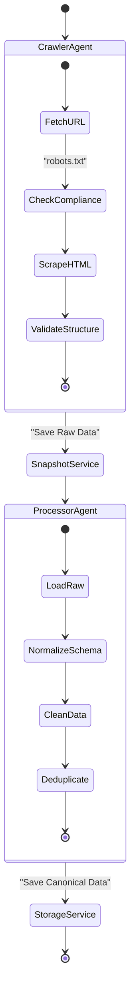

# Agent Workflow

This document explains the autonomous agent system that powers data collection and normalization.

## Agent Architecture

The system uses a **Factory Pattern** to spawn specialized agents for different tasks. All agents inherit from a `BaseAgent` class that handles logging, error recovery, and configuration.

## Agent Examples

### 1. `PisosCrawlerAgent`
- **Goal**: Navigate pagination and listing pages on *pisos.com*.
- **Strategy**: 
    - Respects `robots.txt` and rate limits.
    - Uses randomized User-Agents.
    - extracting JSON-LD structured data when available, falling back to CSS selectors.

### 2. `PisosNormalizerAgent`
- **Goal**: Convert disparate field names into our `CanonicalListing` Pydantic model.
- **Transforms**:
    - `"3 habs"` $\rightarrow$ `bedrooms=3`
    - `"planta 4"` $\rightarrow$ `floor=4`
    - `"250.000 €"` $\rightarrow$ `price=250000.0`, `currency="EUR"`

## Future Expansion
The architecture allows plugging in new agents easily:
- `IdealistaCrawlerAgent`
- `FotocasaCrawlerAgent`
- `NewsAgent` (for macro data)

Each new source only requires a matched pair of **Crawler** and **Processor**; the rest of the pipeline (Storage, Enrichment, Valuation) remains unchanged.
