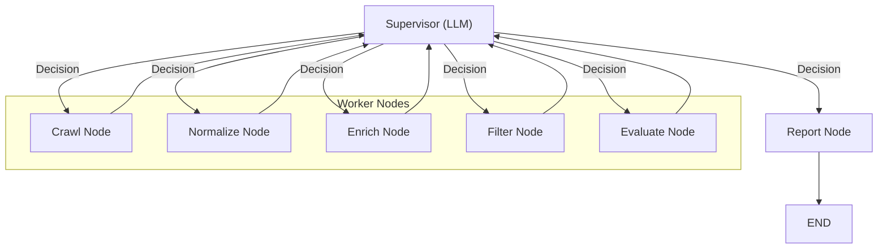

# Agent Workflow

This document explains the autonomous agent system that powers data collection and valuation.

## Agent Architecture

The system uses a **LangGraph** workflow (`src/agentic/graph.py`) to orchestrate the actions of specialized agents. The Supervisor LLM decides the next action based on the current state; no rule-based fallback is used.

### The Supervisor Pattern
Instead of a rigid linear pipeline, the **Supervisor** (an LLM) inspects the `AgentState` (e.g., "Have we crawled data? Is it normalized?") and dynamically routes execution to the appropriate worker node.

**Typical Flow**: `Crawl -> Normalize -> Enrich -> Filter -> Evaluate -> Report`

## Operational Requirements
- Provide `areas` as search URLs, search paths, or plain location strings. The source router maps them to the correct site using `config/sources.yaml`.
- Provide at least one LLM provider (Ollama, Gemini, or OpenAI) for Supervisor + Report.
- Provide a strategy in state (default: `balanced`) if running the graph directly.
- Evaluation is delegated to `ValuationService` and requires comps, indices, model artifacts, and a retriever metadata match (encoder + VLM policy).
- Calibration registry (`models/calibration_registry.json`) is optional but improves interval reliability.

## Agent Examples

### 1. `PisosCrawlerAgent`
- **Goal**: Navigate pagination and listing pages on *pisos.com*.
- **Strategy**: 
    - Respects `robots.txt` and rate limits.
    - Uses randomized User-Agents.
    - extracting JSON-LD structured data when available, plus CSS selectors for robustness.

### 2. `PisosNormalizerAgent`
- **Goal**: Convert disparate field names into our `CanonicalListing` Pydantic model.
- **Transforms**:
    - `"3 habs"` $\rightarrow$ `bedrooms=3`
    - `"planta 4"` $\rightarrow$ `floor=4`
    - `"250.000 €"` $\rightarrow$ `price=250000.0`, `currency="EUR"`

## Future Expansion
The architecture allows plugging in new agents easily:
- `IdealistaCrawlerAgent`
- `FotocasaCrawlerAgent`
- `NewsAgent` (for macro data)

Each new source only requires a matched pair of **Crawler** and **Processor**; the rest of the pipeline (Storage, Enrichment, Valuation) remains unchanged.
