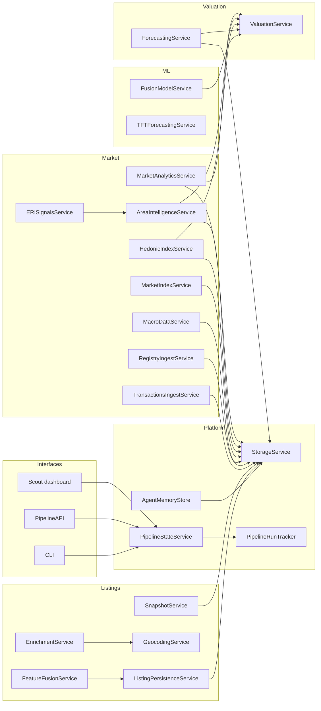
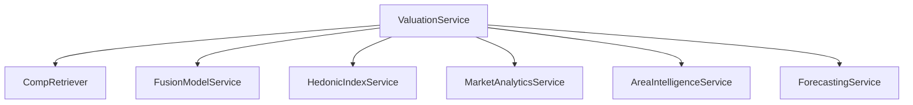

# Services Map

This document is a visual inventory of service classes and their boundaries. It complements:
- `docs/01_system_overview.md` for the full system map
- `docs/02_data_pipeline.md` for execution order and artifacts
- `docs/03_unified_scraping_architecture.md` for the scraping stack

## Service landscape

## Valuation composition (service-level)

## Service boundaries (what each layer owns)

Listings services
- `SnapshotService`: file-backed HTML snapshots; used by crawlers and normalizers.
- `EnrichmentService`: reverse geocode + geohash generation for listings.
- `GeocodingService`: forward geocoding utility (address or title to lat/lon).
- `FeatureFusionService`: merges VLM/text sentiment and enrichments into `CanonicalListing`.
- `ListingPersistenceService`: persistence rules and upsert payloads to `listings`.

Market services
- `TransactionsIngestService`: sold price/status updates into `listings`.
- `RegistryIngestService`: official metrics ingestion into `official_metrics` (INE/ERI/UK/IT).
- `MacroDataService`: macro indicators ingestion and normalization.
- `MarketIndexService`: price and rent indices per region.
- `HedonicIndexService`: time-safe hedonic index construction.
- `AreaIntelligenceService`: area sentiment/development signals (official + geohash local).
- `MarketAnalyticsService`: snapshot metrics (liquidity/momentum/catchup).
- `ERISignalsService`: derived liquidity signals from ERI official metrics.

Valuation and forecasting services
- `ForecastingService`: time-series projections for price and rent.
- `ValuationService`: orchestrates comps, indices, model inference, and adjustments.

ML services
- `FusionModelService`: multimodal pricing model and inference API.
- `TFTForecastingService`: training/inference for the time-series forecaster.

Platform services
- `StorageService`: SQLite connection and session management.
- `PipelineStateService`: freshness checks for listings, indices, and models.
- `PipelineRunTracker`: writes to `pipeline_runs` for operational visibility.
- `AgentMemoryStore`: writes completed agent runs to `agent_runs`.

## Interaction rules (to keep services cohesive)
- Services read/write through repositories and `StorageService`, not direct SQL in workflows.
- Listing enrichment and persistence are isolated from crawlers; crawlers emit raw data only.
- Valuation is strict: missing artifacts are errors, not silent fallbacks.
- Market services derive indicators from `listings` and official sources without mutating listings.
