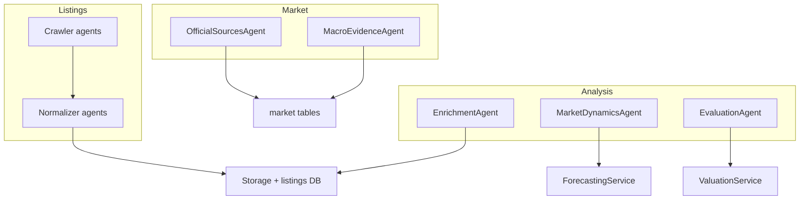

# Agents Map

This document inventories the agents and how they fit together. It complements:
- `docs/06_agent_workflow.md` for planner/executor mechanics
- `docs/03_unified_scraping_architecture.md` for crawler internals
- `docs/02_data_pipeline.md` for full pipeline ordering

## Agent taxonomy (visual)

## Agent inventory by group

Listing crawlers (source-specific)
- `*CrawlerAgent` classes under `src/listings/agents/crawlers/` for portals (Rightmove, Idealista, Zoopla, etc).
- Each crawler focuses on discovery + page fetch; output is `RawListing`.

Listing normalizers (source-specific)
- `*NormalizerAgent` classes under `src/listings/agents/processors/`.
- Normalize raw HTML/JSON into `CanonicalListing` with consistent fields.

Market and official agents
- `OfficialSourcesAgent`: ingests INE/ERI/UK/IT official metrics into `official_metrics`.
- `MacroEvidenceAgent`: macro forecasts with cite-or-drop guarantees.

Analysis agents
- `EnrichmentAgent`: fills missing coordinates/city using Photon + offline reverse geocode.
- `MarketDynamicsAgent`: market snapshot + forward projections per listing.
- `EvaluationAgent`: valuation orchestrator wrapper (comps, model, evidence pack).

Orchestration helpers
- `AgentFactory`: resolves crawler/normalizer pairs by source ID.
- `BaseAgent` + `AgentResponse`: common interface and structured outputs.

## Inputs, outputs, and contracts

AgentResponse contract
- `status`: "success", "failure", or "partial".
- `data`: payload of the agent (listings, profiles, or evidence).
- `errors`: string list, never exceptions; keep failures explicit.

Listing agent flow
- Crawler agents emit `RawListing` with snapshots and metadata.
- Normalizers emit `CanonicalListing`, ready for fusion and persistence.

Market agent flow
- Official and macro agents write to market tables only; they do not mutate listings.

## Adding a new agent (minimal path)
- New source: add `SourceCrawlerAgent` + `SourceNormalizerAgent`, register in `AgentFactory`.
- New market signal: implement a dedicated agent and store output via a repository.
- Follow the AgentResponse contract so downstream workflows can short-circuit safely.
