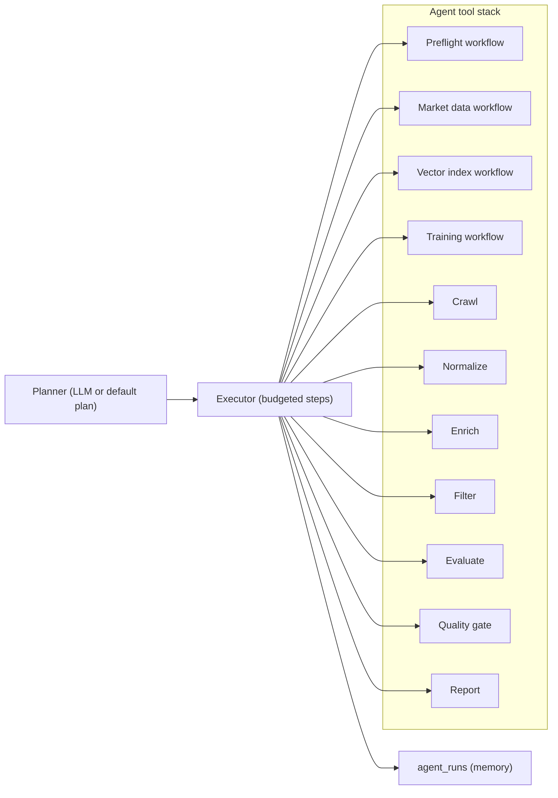

# Agent Workflow

This document explains the autonomous agent system that powers data collection, valuation, and the AI-driven dashboard.

## How the agents run

The system uses a **LangGraph** plan-executor workflow. A planner (LLM) produces a deterministic run plan with tool budgets. The executor then runs each tool step in order. If the plan is invalid, the run fails (no silent fallbacks).

### Planner + executor pattern
Rather than a free-form supervisor loop, the planner builds an explicit plan with budgets. The executor tracks tool usage and stops when the plan is complete. If the plan JSON is missing or invalid, the run stops and returns the error.

**Typical flow**: `preflight (if needed) -> crawl -> normalize -> enrich -> filter -> evaluate -> quality_gate -> report`

**Plan approval**: Plans that include expensive or state-mutating steps (preflight, build_index, train_model, build_market_data) require explicit approval in the dashboard.

## What the agents need
- Provide `areas` as search URLs, search paths, or plain location strings. The source router maps them using `config/sources.yaml`.
- Provide at least one LLM provider via `config/llm.yaml` (LiteLLM supports Ollama, Gemini, OpenAI, etc.) for planning and report generation.
- Optional: enable `llm.normalizer_enabled` to let Instructor fill gaps when HTML normalizers miss fields.
- You can pass an explicit plan or allow the planner to build one; invalid plans are rejected.
- Evaluation is delegated to `ValuationService` and requires comps, indices, model artifacts, and a retriever metadata match (encoder + VLM policy).
- Calibration registry (`models/calibration_registry.json`) is optional but improves interval reliability.
- Strategy/persona controls scoring weights (`balanced`, `cash_flow_investor`, `bargain_hunter`, `safe_bet`).

## Outputs and artifacts
- `final_report`: short narrative summary used in the dashboard.
- `evaluations`: structured deal evaluations with scores and evidence.
- `quality_checks`: pass/fail gates for listing coverage, score bounds, and quantile ordering.
- `ui_blocks`: structured UI payloads (comparison tables, charts, map focus).
- `trace`: action timing and error surfaces for debugging.
- `agent_runs` table: persisted history of completed runs (query, areas, plan, status, and top listings).

## Example agents

### 1. `PisosCrawlerAgent`
- **Goal**: Navigate pagination and listing pages on *pisos.com*.
- **Strategy**: 
    - Respects `robots.txt` and rate limits.
    - Uses randomized User-Agents.
    - Extracts JSON-LD structured data when available, plus CSS selectors for robustness.

### 2. `PisosNormalizerAgent`
- **Goal**: Convert disparate field names into our `CanonicalListing` Pydantic model.
- **Transforms**:
    - `"3 habs"` $\rightarrow$ `bedrooms=3`
    - `"planta 4"` $\rightarrow$ `floor=4`
    - `"250.000 €"` $\rightarrow$ `price=250000.0`, `currency="EUR"`

## Adding new agents
The architecture allows plugging in new agents easily:
- `IdealistaCrawlerAgent`
- `RightmoveCrawlerAgent`
- `ZooplaCrawlerAgent`

Each new source only requires a matched pair of **Crawler** and **Processor**; the rest of the pipeline (Storage, Enrichment, Valuation) remains unchanged.
