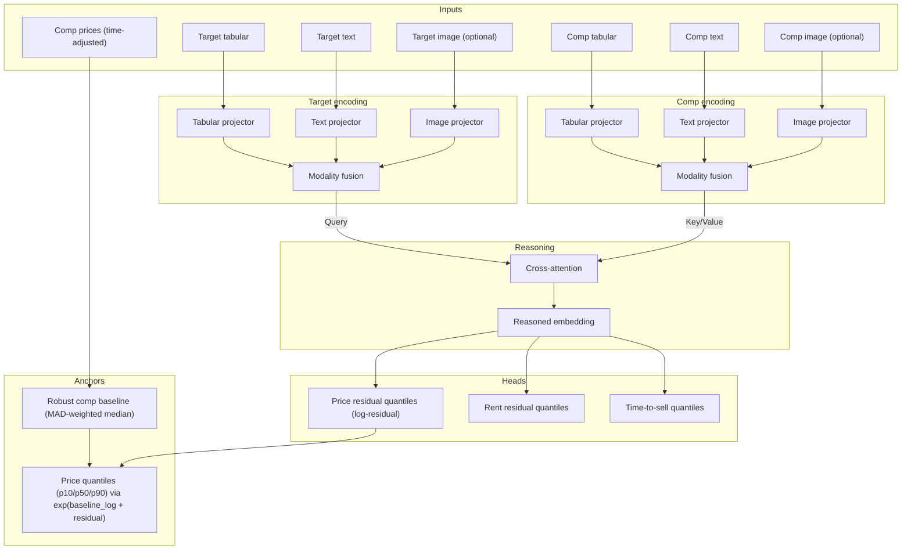
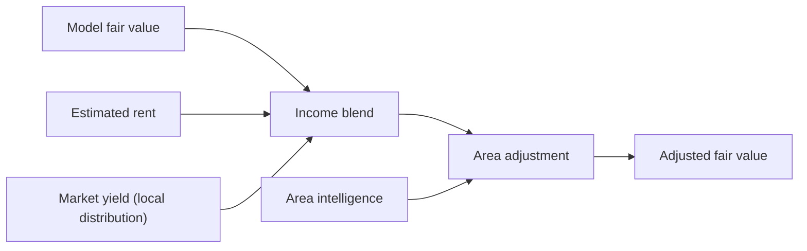

# Models: end-to-end flow

This doc explains the valuation models from data -> training -> inference -> outputs, and how they connect to market/area signals.

At a glance, there are four model layers:
1) Retriever + encoders (SentenceTransformer + tabular encoder; optional VLM text)
2) Fusion model (cross-attention over comps; predicts residual quantiles)
3) Forecasting model (analytic drift or optional TFT)
4) Conformal calibration + blending (intervals, rent/yield, area intel)

## Architecture diagram (valuation path)

## End-to-end model flow

### Training (fusion model)
1) Load listings from `data/listings.db` and sanitize features.
2) Build comps (two-stage): geo-radius filter + size/type compatibility. Optional semantic retriever (LanceDB + SentenceTransformer) when enabled.
3) Time-normalize prices to a reference date (`normalize_to`, default `latest`) using `HedonicIndexService`. This can fall back to registry indices and INE IPV when configured; if `require_hedonic=True`, samples without a clean adjustment are dropped.
4) Compute baseline with a MAD-filtered, weighted median of adjusted comp prices.
5) Target label = `log(target_price_adj) - log(baseline)`.
6) Train PropertyFusionModel with pinball (quantile) loss on residuals.
7) Save artifacts: `models/fusion_model.pt`, `models/fusion_config.json`, optional `models/comp_cache.json`.

### Inference (valuation)
1) Retrieve comps with strict retriever metadata match (model + VLM policy + index fingerprint).
2) Time-adjust comp prices via `HedonicIndexService` (same logic as training).
3) Compute baseline (MAD-weighted median).
4) Encode features (text + tabular; vision is disabled by default in `ValuationService`).
5) Predict residual quantiles with `FusionModelService` (when `target_mode=log_residual`).
6) Reconstruct price quantiles: `exp(log(baseline) + residual_q)`.
7) Conformal calibration (if registry exists) to widen/narrow intervals per horizon.
8) Blend signals: rent comps + yield -> income adjustment; area intelligence (ERI/INE) -> final adjustment.
9) Forecasting generates forward price/rent/yield scenarios.

If the fusion model fails or returns invalid quantiles, the pipeline falls back to a comp-baseline estimate with normal-like quantiles derived from comp price variance.

## Key ideas

### 1. Cross-attention pricing
The model predicts price relative to the market:
- The target listing queries comparable listings via cross-attention.
- A robust comp baseline (MAD-filtered weighted median) is computed outside the model.
- The model predicts log-residuals over the baseline (`target_mode=log_residual` in `models/fusion_config.json`).
- Comp prices are time-adjusted before baseline/residual math via `HedonicIndexService`.
- INE IPV anchors (from `official_metrics` with `provider_id=ine_ipv`) can be used when local data is thin.

### 2. Quantile regression and uncertainty
The model outputs a distribution, not a single number:
- p10: conservative price
- p50: fair value
- p90: optimistic price

Weighted pinball loss trains the quantile heads and encodes label reliability.

### 3. Comparable selection is strict
- Comps are time-safe (comp date <= target date).
- Retriever metadata (encoder + VLM policy + index fingerprint) must match across train and infer.
- Retriever mode can persist comp IDs to reduce train/infer drift.
- If comps or indices are missing, valuation fails instead of guessing (with a comp-baseline fallback only when fusion fails at inference).

### 4. Label strategy
- Sale training labels prefer `sold_price` when available; ask prices are a fallback.
- Rent training labels use asking rent and are normalized via the rent index.
- Label weights reflect reliability: sold > rent ask > sale ask.
- Training target is the log-residual: `log(target_adj) - log(baseline)`.

### 5. Rent + yield signals
- Rent is estimated from rent comps and rent index drift (not from the fusion model).
- Income blending uses market yield distributions with coverage/variance weighting.
- Yield projections combine price forecasts + rent forecasts.

## How the system blends signals
The model output is combined with income and area intelligence signals:

- Income blend uses local yield distributions and weights by rent comp coverage/variance.
- Area adjustment nudges valuation using sentiment and development scores derived from `official_metrics` (ERI/INE), with freshness and credibility scaling.
- Evidence is recorded in `external_signals` for transparency.

## Current configuration
Defined in `models/fusion_config.json` (loaded by `FusionModelService`).

| Parameter | Value | Description |
| --- | --- | --- |
| Tabular Dim | 11 | bedrooms, bathrooms, surface_area_sqm, year_built, floor, lat, lon, price_per_sqm (zeroed), text_sentiment, image_sentiment, has_elevator |
| Text Dim | 384 | SentenceTransformer embedding size |
| Image Dim | 512 | Optional image embedding size |
| Hidden Dim | 64 | Projection size |
| Heads | 2 | Attention heads |
| Parameters | ~92k | Lightweight, CPU-friendly |
| Target Mode | log_residual | Residual target for training/inference |

## What you need to run it
- Model artifacts: `models/fusion_model.pt` and `models/fusion_config.json`.
- Vector index: `data/vector_index.lancedb` + `data/vector_metadata.json`.
- Market tables in `data/listings.db`: `market_indices`, `hedonic_indices`, `macro_indicators`, `area_intelligence`.
- Optional calibrators: `models/calibration_registry.json`.
