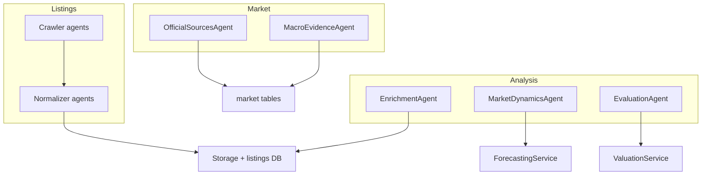
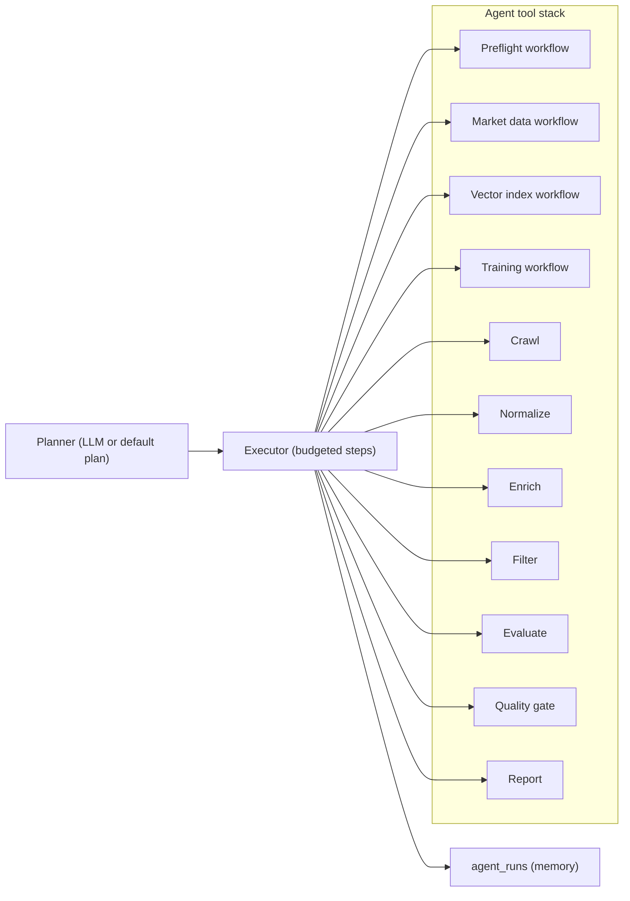

# Agent System And Workflow

This page explains the agent taxonomy and planner/executor mechanics used by the cognitive workflow.

Related pages:
- `docs/explanation/scraping_architecture.md`
- `docs/explanation/services_map.md`
- `docs/manifest/09_runbook.md`

## Agent Taxonomy

## Planner/Executor Workflow

The system uses a LangGraph plan-executor workflow:
- planner builds a deterministic run plan with tool budgets,
- executor runs each step in order and enforces budgets,
- invalid plans fail fast (no silent fallback plan generation).

Typical flow:
`preflight -> crawl -> normalize -> enrich -> filter -> evaluate -> quality_gate -> report`

Plan approval:
- plans including costly/state-mutating steps (`preflight`, `build_index`, `train_model`, `build_market_data`) require explicit approval in dashboard flows.

## Agent Inventory

Listing crawlers:
- source-specific `*CrawlerAgent` classes in `src/listings/agents/crawlers/`.

Listing normalizers:
- source-specific `*NormalizerAgent` classes in `src/listings/agents/processors/`.

Market and official agents:
- `OfficialSourcesAgent`: ingests official metrics into `official_metrics`.
- `MacroEvidenceAgent`: macro forecasts with cite-or-drop guarantees.

Analysis agents:
- `EnrichmentAgent`: fills missing coordinates/city signals.
- `MarketDynamicsAgent`: market snapshot + forward projections.
- `EvaluationAgent`: valuation orchestrator wrapper.

Orchestration helpers:
- `AgentFactory`: resolves crawler/normalizer pairs by source ID.
- `BaseAgent` + `AgentResponse`: shared agent contracts.

## Contracts

`AgentResponse` contract:
- `status`: `success`, `failure`, or `partial`
- `data`: typed payload
- `errors`: explicit error list

Flow contracts:
- crawler agents emit `RawListing`
- normalizers emit `CanonicalListing`
- market agents write market tables and do not mutate listings

## Adding A New Agent

- New source: add crawler + normalizer pair and register in `AgentFactory`.
- New market signal: implement dedicated agent and persist through repository/service boundaries.
- Keep `AgentResponse` contract strict so downstream workflows can short-circuit safely.
