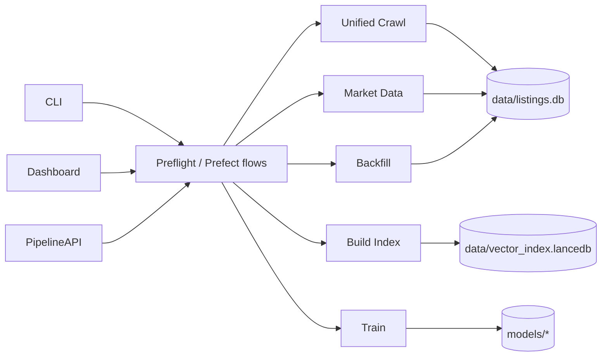

# Architecture Overview

For canonical architecture details, see `docs/manifest/01_architecture.md`.

## High-Level Shape

Property Scanner uses three interface surfaces over shared workflow/service layers:

- CLI: `src/interfaces/cli.py`
- Dashboard: `src/interfaces/dashboard/app.py`
- API: `src/interfaces/api/pipeline.py`

Core workflows:
- unified crawl
- market data build
- vector index build
- training
- valuation backfill

## Data Flow

## Reliability and Guardrails

- Observability and SLI/SLO definitions: `docs/manifest/07_observability.md`
- Command map and triage commands: `docs/manifest/09_runbook.md`
- CI and docs-sync guardrails: `docs/manifest/11_ci.md`, `.github/workflows/ci.yml`

## Detailed Explanation Pages

- `docs/explanation/system_overview.md`
- `docs/explanation/data_pipeline.md`
- `docs/explanation/scraping_architecture.md`
- `docs/explanation/services_map.md`
- `docs/explanation/agent_system.md`
- `docs/explanation/model_architecture.md`
- `docs/explanation/production_path.md`
