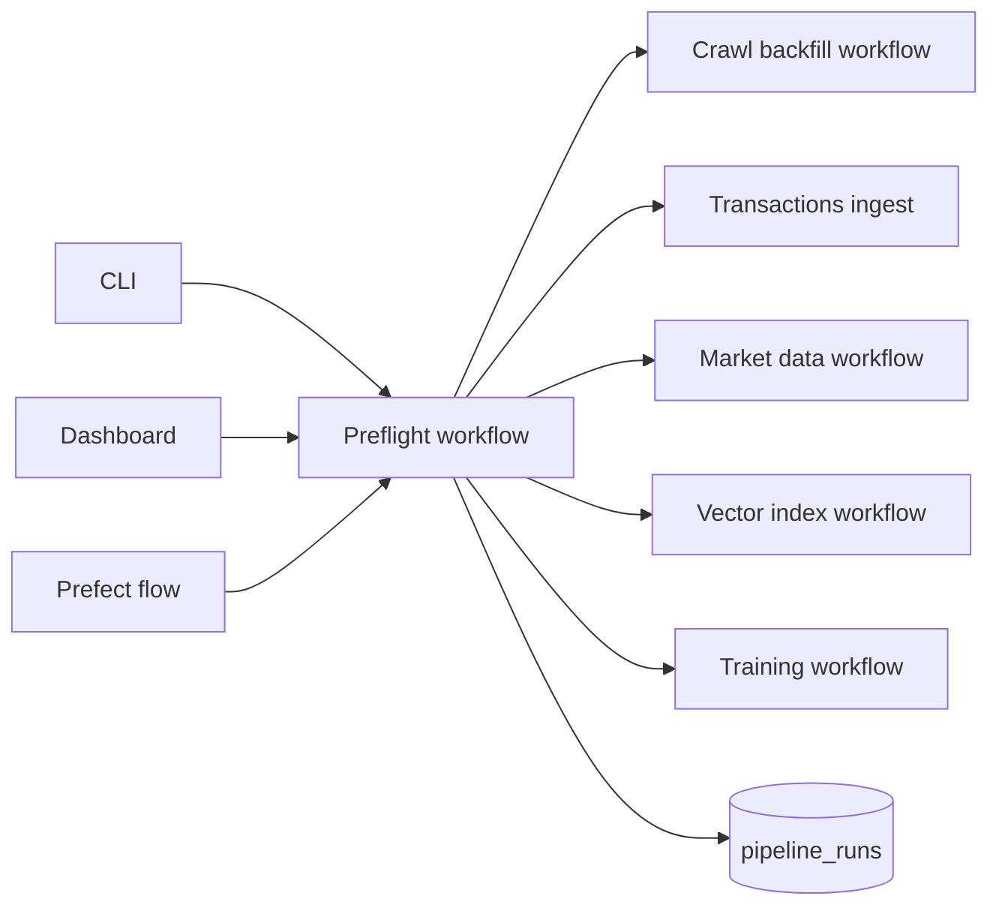
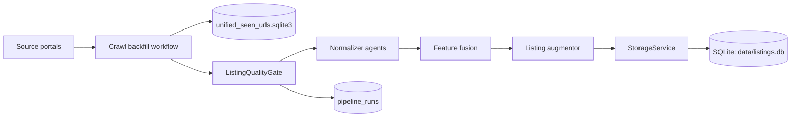
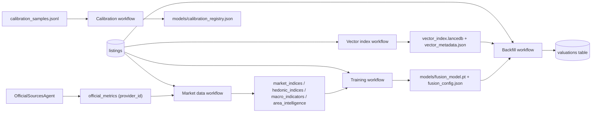
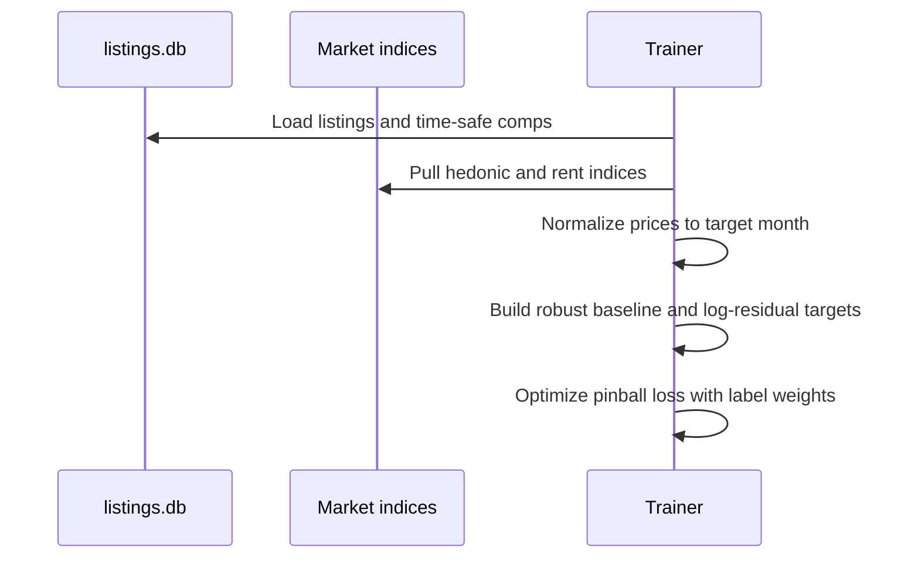

# Data And Training Pipeline

This page summarizes how listings flow through the system, how derived artifacts are produced, and where quality gates stop bad data.

For runnable operator commands, use:
- `docs/how_to/run_end_to_end.md`
- `docs/manifest/09_runbook.md`

## Start Here: Preflight

Preflight is the canonical entrypoint. It checks freshness and only runs stale steps.



- `python3 -m src.interfaces.cli dashboard` triggers preflight unless `--skip-preflight` is passed.
- `python3 -m src.interfaces.cli preflight` runs preflight with retries and task-level caching.
- Use `python3 -m src.interfaces.cli prefect preflight --help` for full flow-level flags.
- Preflight compares listing freshness against market data, index files, and model artifacts.
- Transactions ingest runs before market-data/training unless `--skip-transactions` is passed.

## Ingestion: Crawl Backfill With Quality Gates



- URL de-dupe is handled by `SeenUrlStore`.
- Listings are validated before persistence.
- If invalid ratio exceeds threshold, the crawl fails fast.

## Transactions Ingest

```bash
python3 -m src.interfaces.cli transactions -- --path data/transactions.csv
```

- Runs the Prefect transactions flow (`prefect transactions` for explicit flow-level surface).
- Ingests sold price/date updates.
- Matches by `listing_id`, `(source_id, external_id)`, or `url`.
- Updates `status`, `sold_price`, and `sold_at` so downstream training uses stronger labels.

## Derived Data And Caches



Recommended manual order:
1. Crawl backfill + normalize + store
2. Ingest transactions
3. Build market data
4. Build vector index
5. Train fusion model
6. Backfill valuations
7. Update calibration registry

## Quality Gates And Run Logs

- `ListingQualityGate` rejects listings missing required fields.
- Invalid-ratio thresholds stop bad batches before persistence.
- Every workflow run writes metadata into `pipeline_runs`.

## Data Assets On Disk

| Artifact | Purpose | Produced by | Notes |
| --- | --- | --- | --- |
| `data/listings.db` (listings) | Primary dataset | `StorageService` | System of record |
| `data/listings.db` (market/hedonic) | Derived indices | Market data workflow | Market + hedonic indices |
| `data/listings.db` (official_metrics) | Official stats | `OfficialSourcesAgent` | Benchmark anchors + liquidity signals |
| `data/listings.db` (pipeline_runs) | Operational logs | `PipelineRunTracker` | Run metadata |
| `data/listings.db` (agent_runs) | Agent run memory | `CognitiveOrchestrator` | Query/plan/status/top picks |
| `data/vector_index.lancedb` | Dense comp index | Indexing workflow | Required for comps |
| `data/vector_metadata.json` | Comp metadata | Indexing workflow | Encoder + policy lock |
| `data/unified_seen_urls.sqlite3` | URL de-dupe | `SeenUrlStore` | Safe to remove for forced re-crawl |
| `models/fusion_model.pt` | Trained fusion model | Training workflow | Required for valuation |
| `models/fusion_config.json` | Fusion model config | Training workflow | Required for valuation |
| `models/comp_cache.json` | Comp cache (optional) | Training workflow | Created only when enabled |
| `models/calibration_registry.json` | Conformal calibrators | Calibration workflow | Optional but recommended |

## Multimodal Training At A Glance



- VLM descriptions are stored in `vlm_description` and treated as extra text.
- Comp selection is time-safe and deduped; retriever mode locks encoder + VLM policy.
- Time+geo splits are available (`--split-strategy time_geo`) to reduce leakage.
- Valuation is strict: missing comps, indices, or model artifacts are explicit failures.
