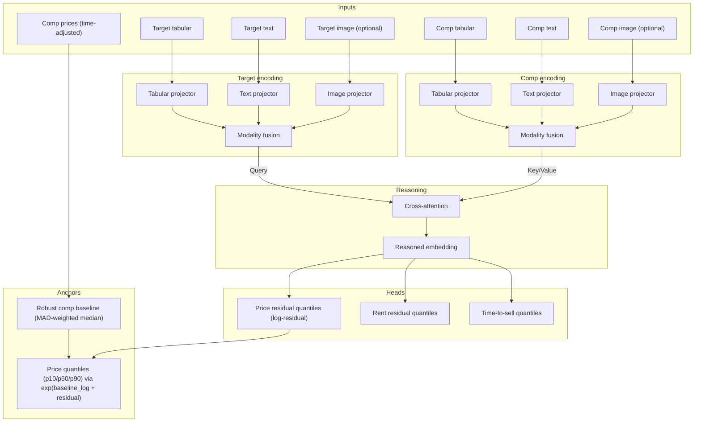
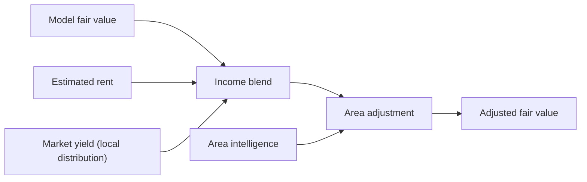

# Model Architecture

This page explains valuation modeling from data -> training -> inference -> outputs, and how market/area signals are blended.

Canonical runtime and reliability controls live in:
- `docs/manifest/01_architecture.md`
- `docs/manifest/07_observability.md`
- `docs/manifest/10_testing.md`

## Model Layers

1. Retriever + encoders (SentenceTransformer + tabular encoder; optional VLM text)
2. Fusion model (cross-attention over comps; predicts residual quantiles)
3. Forecasting model (analytic drift or optional TFT)
4. Conformal calibration + blending (intervals, rent/yield, area intelligence)

## Valuation Path

## End-To-End Flow

### Training

1. Load listings from `data/listings.db` and sanitize features.
2. Build comps (geo-radius + structure filters, optional semantic retriever).
3. Time-normalize prices using `HedonicIndexService`.
4. Compute baseline with MAD-filtered weighted median.
5. Target label: `log(target_price_adj) - log(baseline)`.
6. Train `PropertyFusionModel` with quantile pinball loss.
7. Save artifacts: `models/fusion_model.pt`, `models/fusion_config.json`, optional `models/comp_cache.json`.

### Inference

1. Retrieve comps with strict retriever metadata matching.
2. Time-adjust comp prices.
3. Compute robust baseline.
4. Encode features (text + tabular; vision optional by policy).
5. Predict residual quantiles via `FusionModelService`.
6. Reconstruct price quantiles from baseline + residual.
7. Apply conformal calibration (if registry exists).
8. Blend rent/yield and area-intelligence signals.
9. Produce forward projections (price/rent/yield).

If fusion fails or returns invalid quantiles, valuation falls back to comp-baseline-derived quantiles.

## Key Modeling Policies

### Cross-attention pricing

- Model predicts price relative to market baseline.
- Baseline is computed outside the model from time-adjusted comps.
- `target_mode=log_residual` aligns train and infer behavior.

### Quantile-first outputs

- p10: conservative
- p50: fair value
- p90: optimistic

Quantile heads are trained with weighted pinball loss.

### Strict comp selection

- time-safe comp dates
- retriever metadata/policy lock
- optional persisted comp IDs for train/infer parity
- explicit failures for missing required artifacts

### Label strategy

- sale labels prefer `sold_price` when available, then ask fallback
- rent labels use rent ask and rent-index normalization
- reliability weighting: sold > rent ask > sale ask

## Signal Blending

- Income blend uses local yield distributions with coverage/variance weighting.
- Area adjustment applies sentiment/development signals with freshness + confidence scaling.
- Evidence is persisted for auditability.

## Current Config Snapshot

Defined in `models/fusion_config.json` (loaded by `FusionModelService`).

| Parameter | Value | Description |
| --- | --- | --- |
| Tabular dim | 11 | structured listing features |
| Text dim | 384 | SentenceTransformer embedding size |
| Image dim | 512 | optional image embedding size |
| Hidden dim | 64 | projection size |
| Heads | 2 | attention heads |
| Params | ~92k | lightweight CPU-friendly model |
| Target mode | `log_residual` | residual target for train/infer parity |

## Required Artifacts

- `models/fusion_model.pt`
- `models/fusion_config.json`
- `data/vector_index.lancedb`
- `data/vector_metadata.json`
- market tables in `data/listings.db`
- optional: `models/calibration_registry.json`
