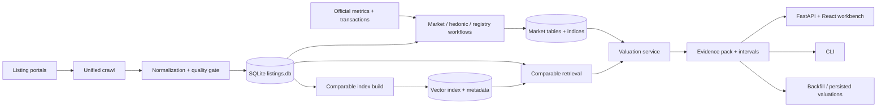
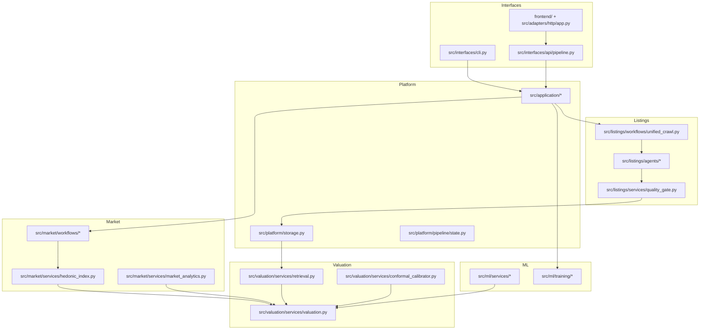

# Property Scanner: Problem Landscape, Core Ideas, and How This Repository Solves It

## TL;DR

- **What problem this solves:** turning messy listing portals, uneven market data, and uncertain valuation logic into a local, inspectable workflow for real-estate analysis.
- **Who it is for:** solo investors, analysts, and contributors who want reproducible property intelligence instead of a black box with a cheerful confidence score.
- **What is interesting about the approach:** Property Scanner treats valuation as a **comp-anchored, evidence-carrying pipeline**, not just a direct price prediction problem.
- **What you should understand after reading:** why property valuation is hard, what this repo chooses to optimize for, how the math and data flow fit together, and where those ideas live in the codebase.

## 1. The problem landscape

Residential property intelligence sounds simple until you try to make it operational.

At a high level, people want to answer questions like:

- What is this listing probably worth today?
- How good is this deal relative to nearby alternatives?
- Which listings deserve manual attention first?
- What do I trust, and what is too stale, sparse, or noisy to use?

Those are hard questions because the underlying data is hostile to clean modeling:

- **Listings are messy.** Portals expose ask prices, partial features, duplicated inventory, and inconsistent location detail.
- **Markets drift over time.** A comp from nine months ago is not comparable unless you explicitly time-adjust it.
- **Good labels are scarce.** Sold prices are much better than ask prices for sale valuation, but they are often missing or incomplete.
- **Scraping is adversarial.** Anti-bot controls, robots restrictions, and volatile HTML make collection itself a reliability problem.
- **Similarity is multi-dimensional.** Two apartments can be geographically close but structurally mismatched, or textually similar but in different market regimes.
- **Uncertainty matters.** A point estimate without calibration is usually a confidence costume.

That leads to a few common solution families:

| Family | Strength | Weakness |
| --- | --- | --- |
| Rule-based comparable systems | Interpretable and easy to audit | Brittle, shallow, and weak under noisy or sparse comps |
| Pure hedonic models | Economically grounded | Often miss local comparability and non-linear effects |
| End-to-end black-box price predictors | Can fit rich patterns | Easy to over-trust, hard to audit, fragile under drift |
| Marketplace heuristics and dashboards | Practical for triage | Often hide assumptions and data quality problems |

Property Scanner sits in the middle of that landscape:

- it keeps the **comparable-sales intuition**,
- uses **market indices** to time-adjust evidence,
- adds **retrieval and optional ML fusion** where they help,
- and insists on **explicit readiness, freshness, and uncertainty semantics**.

This is not a “push button, trust the magic” AVM. It is closer to a local-first analyst workbench with a valuation engine inside.

## 2. What this library believes / optimizes for

Property Scanner has a clear bias in its design:

- **Local-first over hosted-first.** SQLite, local artifacts, local UI, local CLI.
- **Auditability over cosmetic simplicity.** The system prefers explicit evidence, reason codes, and persisted artifacts.
- **Comparable-anchored valuation over raw end-to-end prediction.** The repo treats direct price prediction as insufficiently trustworthy on its own.
- **Operational truth over fake success.** Blocked portals should look blocked. Degraded sources should look degraded.
- **Freshness and readiness gates over silent fallback.** The pipeline tracks whether listings, market data, indices, and models are stale.
- **Optional enrichment, not mandatory magic.** LLM/VLM paths exist, but the core workflow must still behave sensibly when they are unavailable.

Just as important are the things it explicitly does **not** try to do:

- guarantee live crawling across every portal,
- replace an official appraisal process,
- provide legal or investment advice,
- operate as a multi-tenant SaaS product in the current milestone.

Those non-goals matter because they explain many design choices. The repo is optimized for a technically serious local workflow, not maximal source coverage or consumer-grade product gloss.

## 3. The core solution in plain language

The repository’s core idea is straightforward:

1. **Collect listings** from multiple portals and normalize them into one schema.
2. **Reject bad inputs early** using explicit quality gates.
3. **Build market context** so old comps can be adjusted into the target time regime.
4. **Retrieve plausible comparables** with geographic, structural, and optional semantic constraints.
5. **Estimate fair value relative to a robust baseline** built from those adjusted comps.
6. **Wrap the output in evidence and calibrated intervals** instead of pretending the estimate is exact.
7. **Expose the result in a workbench** where source quality, readiness, and next actions stay visible.

The most important design move is this one:

> Estimate value **relative to a comp baseline**, not from scratch.

That lets the system preserve the strongest part of traditional property analysis, while still using machine learning and retrieval where they add value.

## 4. System / pipeline overview

### End-to-end flow

### Concept-to-code map

## 5. From concept to code

### Interfaces: how users touch the system

- `src/interfaces/cli.py`
  - the command router for preflight, crawl, market-data, build-index, training, benchmarking, calibration, and API launch
- `src/interfaces/api/pipeline.py`
  - the application-facing service layer behind the local FastAPI API
- `frontend/` plus `src/adapters/http/app.py`
  - the current primary UI surface: the React workbench served by FastAPI

This is the top layer, not the core logic. It is where workflow orchestration gets exposed, not where valuation truth is decided.

### Listings: data acquisition and cleanup

- `src/listings/workflows/unified_crawl.py`
  - runs crawl plans, deduplicates, normalizes, and persists results
- `src/listings/agents/crawlers/*`
  - source-specific fetch and extraction logic
- `src/listings/services/quality_gate.py`
  - rejects invalid or corrupted listings before they become trusted inputs

This layer exists because property valuation quality is mostly downstream of data quality. If the listing is wrong, the math is decoration.

### Market layer: turning raw listings into time-aware evidence

- `src/market/workflows/*`
  - build market and transaction artifacts
- `src/market/services/hedonic_index.py`
  - time adjustment via index-based normalization
- `src/market/services/market_analytics.py`
  - local market context and derived signals

This is what keeps the repo from comparing today’s target with yesterday’s market without adjustment.

### Retrieval and valuation: the center of gravity

- `src/valuation/services/retrieval.py`
  - retrieves comparables with geographic, temporal, and structural filters, plus semantic retrieval support
- `src/valuation/services/valuation.py`
  - orchestrates comp adjustment, baseline formation, residual prediction, projections, and evidence packing
- `src/valuation/services/conformal_calibrator.py`
  - controls interval calibration and fallback behavior by segment

This is the repository’s real conceptual center. Everything else either feeds it or exposes it.

### ML services: optional complexity with explicit gates

- `src/ml/services/*`
  - model-serving and encoding helpers
- `src/ml/training/train.py`
  - training workflows
- `src/ml/training/benchmark.py`
  - baseline comparisons and readiness-gated evaluation
- `src/ml/training/retriever_ablation.py`
  - measures whether semantic retrieval complexity earns its keep

The repo is intentionally suspicious of complexity. It includes richer model paths, but it also includes gates designed to justify or reject them.

### Platform and application services

- `src/platform/storage.py`
  - persistence backbone
- `src/platform/pipeline/state.py`
  - freshness and readiness logic
- `src/application/*`
  - jobs, reporting, source capability summaries, and workbench-facing services

This layer is what turns “a bunch of scripts” into a coherent local product.

## 6. Mathematical / algorithmic foundations

The repo uses math in a restrained way. The equations matter because they explain **why** the valuation path is comp-anchored and **how** uncertainty is represented.

### 6.1 Time adjustment with a market index

If a comparable listing \(i\) was observed at time \(t_i\), and the target is evaluated at time \(t^\*\), the comp price is adjusted with a market index \(I(\cdot)\):

$$
\tilde{p}_i = p_i \cdot \frac{I(t^\*)}{I(t_i)}
$$

Where:

- \(p_i\) is the observed comp price,
- \(I(t_i)\) is the index level when that comp was observed,
- \(I(t^\*)\) is the target-time index level,
- \(\tilde{p}_i\) is the time-adjusted comp price.

How the repo implements it:

- `src/market/services/hedonic_index.py` computes adjustment factors and adjusted prices.
- `src/valuation/services/valuation.py` applies those factors before forming the baseline.

Why it matters:

- without this step, old comps contaminate present-day valuation with regime drift.

### 6.2 Robust comparable baseline

The target value is not predicted directly from thin air. The system first forms a robust baseline \(b(\mathcal{C})\) from the comparable set \(\mathcal{C}\).

Conceptually:

$$
b(\mathcal{C}) = \text{robust\_aggregate}\left(\tilde{p}_1, \tilde{p}_2, \dots, \tilde{p}_k\right)
$$

The exact aggregate is intentionally robust rather than naive averaging. The repo’s docs and comments frame this as a weighted, outlier-resistant comp anchor.

How the repo implements it:

- the baseline logic is embedded in `src/valuation/services/valuation.py`
- the repository’s model architecture docs describe a MAD-style robust baseline feeding residual prediction

Why it matters:

- property data is noisy enough that a fragile average is often worse than an honest conservative anchor.

### 6.3 Residual modeling instead of direct price modeling

Once the comp baseline exists, the model predicts the difference between the target and that baseline in log space:

$$
r = \log p_{\text{target}} - \log b(\mathcal{C})
$$

Where:

- \(p_{\text{target}}\) is the target property value,
- \(b(\mathcal{C})\) is the baseline from adjusted comps,
- \(r\) is the residual the model learns to predict.

This means the model is learning “how the target differs from reasonable comps,” not “what price should exist in a vacuum.”

How the repo implements it:

- `docs/explanation/model_architecture.md` documents the `log_residual` target mode
- `src/valuation/services/valuation.py` reconstructs output quantiles from the comp baseline plus residual predictions

Why it matters:

- residual modeling is easier to stabilize and easier to interpret than unconstrained direct prediction in this domain.

### 6.4 Quantile outputs and conformal calibration

The repo is built around quantile-style outputs such as \(p10\), \(p50\), and \(p90\), rather than a single point estimate.

Those quantiles are then calibrated by segment when enough evidence exists. When segment evidence is weak, the repo falls back to a broader uncertainty mode instead of pretending coverage is still trustworthy.

How the repo implements it:

- `src/valuation/services/conformal_calibrator.py`
  - segmented coverage tracking
  - interval policy
  - calibrated vs bootstrap fallback behavior
- `src/valuation/services/valuation.py`
  - applies interval policy decisions during inference

Why it matters:

- in property valuation, “this is probably worth around X, and here is why that interval is wide” is much more honest than a precise-looking point estimate.

## 7. Related work and relevant papers

Property Scanner is not a direct implementation of one paper. It is a practical synthesis of ideas from housing economics, tabular ML, retrieval, and conformal uncertainty.

| Reference | Link | What it contributes | Why it matters here |
| --- | --- | --- | --- |
| Bailey, Muth, Nourse (1963), *A Regression Method for Real Estate Price Index Construction* | [JASA / DOI](https://doi.org/10.1080/01621459.1963.10480679) | Foundational repeat-sales index construction | Explains why time normalization matters before comparing old and new listings |
| Case, Shiller (1987), *Prices of Single Family Homes Since 1970* | [NBER Working Paper 2393](https://www.nber.org/papers/w2393) | Practical repeat-sales housing price indexing | Supports the repo’s market-index adjustment logic |
| Case, Shiller (1988), *The Behavior of Home Buyers in Boom and Post-Boom Markets* / related inefficiency work | [NBER Working Paper 2506](https://www.nber.org/papers/w2506) | Housing market persistence and inefficiency | Helps explain why stale comps are dangerous without adjustment |
| Rosen (1974), *Hedonic Prices and Implicit Markets* | [JSTOR](https://www.jstor.org/stable/1830899) | Classic hedonic pricing framework | Grounds the attribute-based logic behind the market and valuation layers |
| Deng, Gyourko, Wu (2012), *Land and House Price Measurement in China* | [NBER Working Paper 18403](https://www.nber.org/papers/w18403) | Measurement risk in fast-moving property markets | Motivates the repo’s caution around land/structure decomposition and regime sensitivity |
| Koenker, Bassett (1978), *Regression Quantiles* | [Econometrica / JSTOR](https://www.jstor.org/stable/1913643) | Quantile regression foundation | Relevant because the repo thinks in quantiles and uncertainty bands, not only means |
| Breiman (2001), *Random Forests* | [Springer](https://doi.org/10.1023/A:1010933404324) | Strong non-linear tabular baseline | The repo benchmarks richer paths against robust tree baselines |
| Chen, Guestrin (2016), *XGBoost: A Scalable Tree Boosting System* | [ACM KDD](https://doi.org/10.1145/2939672.2939785) | Strong gradient-boosted baseline family | Important for understanding why “better than trees” must be demonstrated, not assumed |
| Reimers, Gurevych (2019), *Sentence-BERT* | [arXiv](https://arxiv.org/abs/1908.10084) | Practical sentence embeddings for similarity search | Directly relevant to semantic comparable retrieval |
| Romano, Patterson, Candès (2019), *Conformalized Quantile Regression* | [NeurIPS / arXiv](https://arxiv.org/abs/1905.03222) | Coverage-aware quantile calibration | Maps directly onto the repo’s interval-calibration philosophy |
| Barber et al. (2021), *Predictive Inference with the Jackknife+* | [Annals of Statistics / DOI](https://doi.org/10.1214/20-AOS1965) | Model-agnostic predictive intervals | Supports the repo’s fallback interval policy for weak regimes |
| Angelopoulos, Bates (2021), *A Gentle Introduction to Conformal Prediction* | [arXiv](https://arxiv.org/abs/2107.07511) | Practical guide to conformal assumptions and caveats | Useful for understanding why the repo tracks subgroup coverage and fallback states |
| Eurostat, *Handbook on Residential Property Prices Indices* | [Eurostat](https://ec.europa.eu/eurostat/web/products-manuals-and-guidelines/-/ks-gq-14-008) | Official index methodology reference | Relevant because the repo’s time-adjustment logic borrows from official house-price-index thinking |
| RICS, *RICS Valuation - Global Standards (Red Book)* | [RICS](https://www.rics.org/standards/rics-valuation-global-standards-red-book) | Professional valuation standards framing | Helpful for interpreting the repo as decision support, not an official appraisal substitute |

### Suggested reading order

1. Rosen (hedonic intuition)
2. Bailey-Muth-Nourse and Case-Shiller (time adjustment and housing indices)
3. Reimers-Gurevych (semantic retrieval intuition)
4. Koenker-Bassett and Romano-Patterson-Candès (quantiles and calibration)
5. Barber et al. and Angelopoulos-Bates (why interval guarantees are conditional and fragile in practice)

## 8. End-to-end mental model

### Story 1: I open the workbench and inspect a listing

1. The React workbench loads through the local FastAPI app.
2. It asks the backend for pipeline status, source support status, and workbench listing data.
3. The selected listing already carries the consequences of upstream decisions:
   - normalized fields,
   - source-quality state,
   - readiness state,
   - cached valuation or explicit reason it is unavailable.
4. If a valuation exists, the workbench shows a fair value, support level, and next action.
5. If a valuation is unavailable, the UI still tells you *why*.

That last point is important. “Surface area missing” is useful. “Something failed” is not.

### Story 2: I refresh the pipeline and backfill valuations

1. You run `preflight`.
2. The pipeline checks what is stale:
   - listings,
   - market data,
   - retrieval index,
   - model artifacts.
3. The necessary workflow stages run in order.
4. Listings are crawled, normalized, and quality-gated.
5. Market/index artifacts are rebuilt or refreshed.
6. Retrieval metadata and valuation services consume those artifacts.
7. Backfill or direct valuation requests persist evidence-rich outputs.

This gives the repo a clear operational story:

- acquisition,
- normalization,
- market alignment,
- retrieval,
- valuation,
- evidence,
- UI/API exposure.

## 9. When this approach works well / when it doesn’t

### Works well when

- local markets have enough comparable evidence,
- indices are reasonably current,
- listing features are present and not badly corrupted,
- source quality is explicit and respected,
- the user values inspectability more than flashy predictions.

### Works less well when

- sold labels are absent or too sparse,
- sources are blocked or degraded,
- location or surface-area fields are missing,
- market regimes shift faster than the calibration evidence,
- the user expects universal source coverage or official-appraisal certainty.

### Practical limitations in this repo

- anti-bot protections constrain live crawling,
- some sources are intentionally classified as blocked or degraded,
- sale-model training and benchmarking are readiness-gated by closed-sale labels,
- stale data is treated as a first-class operational problem, not hidden behind optimistic UI.

## 10. Practical reading guide for the codebase

If you are new to the repository, read in this order:

1. `docs/manifest/00_overview.md`
   - the product boundary and non-goals
2. `README.md`
   - the practical front door
3. `docs/explanation/problem_landscape_and_solution.md`
   - this page
4. `docs/explanation/system_overview.md`
   - the architecture map
5. `src/interfaces/cli.py`
   - the runnable entrypoints
6. `src/listings/workflows/unified_crawl.py`
   - how data gets in
7. `src/valuation/services/retrieval.py`
   - how comparables are chosen
8. `src/valuation/services/valuation.py`
   - how values are formed
9. `src/market/services/hedonic_index.py`
   - how time adjustment works
10. `tests/unit/valuation/sota/test_valuation_sota__hedonic_conformal_integration.py`
    - a compact way to see the intended valuation behavior

After that, branch into:

- `docs/explanation/model_architecture.md`
- `docs/explanation/scraping_architecture.md`
- `docs/how_to/interpret_outputs.md`
- `docs/manifest/20_literature_review.md`

## 11. Glossary

- **Canonical listing:** the normalized listing object used across services.
- **Comp:** a comparable property used as valuation evidence.
- **Comp baseline:** the robust anchor built from time-adjusted comparables before residual modeling.
- **Conformal calibration:** a post-model procedure that adjusts intervals to better match empirical coverage.
- **Degraded source:** a source that can still appear in the system but fails quality or freshness expectations.
- **Evidence pack:** the persisted structured explanation attached to a valuation.
- **Freshness gate:** logic that decides whether crawl, market, index, or training artifacts are stale enough to refresh.
- **Local-first:** the repo assumes one machine, local files, and SQLite by default.
- **Preflight:** the canonical orchestration entrypoint that decides what work needs to run.
- **Readiness gate:** logic that blocks workflows when required evidence, labels, or artifact prerequisites are missing.
- **Time adjustment:** moving an old comp into the target market regime using an index factor.

For the shorter project-wide glossary, see `docs/glossary.md`.

## 12. Further exploration

- Quickstart: [`docs/getting_started/quickstart.md`](../getting_started/quickstart.md)
- CLI reference: [`docs/reference/cli.md`](../reference/cli.md)
- Output semantics: [`docs/how_to/interpret_outputs.md`](../how_to/interpret_outputs.md)
- System overview: [`docs/explanation/system_overview.md`](./system_overview.md)
- Model architecture: [`docs/explanation/model_architecture.md`](./model_architecture.md)
- Scraping architecture: [`docs/explanation/scraping_architecture.md`](./scraping_architecture.md)
- Literature review: [`docs/manifest/20_literature_review.md`](../manifest/20_literature_review.md)
- Notebook: [`notebooks/project_overview.ipynb`](../../notebooks/project_overview.ipynb)
- Tests:
  - `tests/unit/valuation/`
  - `tests/integration/valuation/`
  - `tests/e2e/ui/`

If you want one sentence to keep in your head while reading the repo, use this:

> Property Scanner is a local analyst system that tries to make property valuation *earned* by evidence, not merely computed by code.
