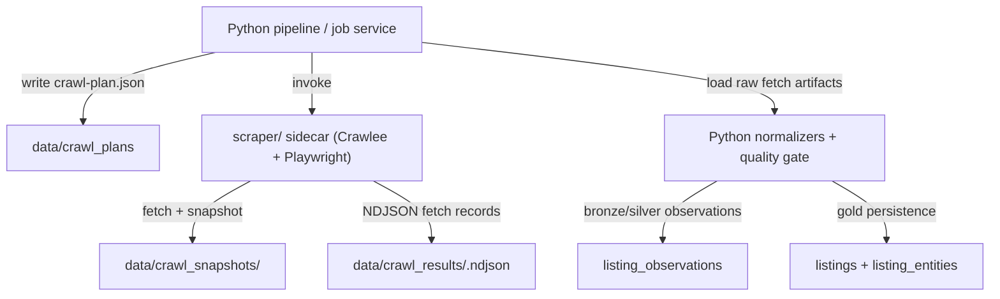

# Scraping Architecture

The canonical crawl direction is now a split system:

- Python owns crawl planning, compliance policy, normalization, validation, persistence, and job tracking.
- The Node/TypeScript sidecar in `scraper/` owns browser-heavy fetch execution with Crawlee + Playwright.
- The older pydoll path remains in the repo only as a transitional implementation and is no longer the strategic browser stack.

For current source availability and caveats, see `docs/crawler_status.md`.

## Design Principles

- Separate fetch from parse: browser automation should only fetch and snapshot pages; source-specific extraction stays testable in Python fixtures.
- Compliance first: robots checks are enabled by default and blocked sources should degrade explicitly instead of looping through retries forever.
- Local-first artifacts: every crawl run writes a plan, NDJSON fetch results, and raw snapshots under `data/`.
- Capability-gated sources: operational support is determined by source-health evidence, not by whether a crawler module exists.

## Canonical Flow

## Crawl Contract

### Plan input

Python writes a typed plan with:

- `job_id`
- `source_id`
- `mode`
- `start_urls`
- `max_pages`
- `max_listings`
- `page_size`
- `proxy_policy`
- `session_policy`
- `snapshot_dir`
- `result_path`

Current implementation:

- Python contract and invoker: `src/listings/scraping/sidecar.py`
- Sidecar runner: `scraper/src/index.ts`

### Result output

Each fetched page produces one NDJSON row with:

- `source_id`
- `url`
- `status`
- `http_status`
- `blocked_signal`
- `snapshot_path`
- `content_type`
- `fetched_at`
- `error`

## Compliance Policy

- `ComplianceManager` enforces rate limits and robots checks by default.
- If robots disallow access, the fetch is skipped and the source should be treated as degraded or blocked operationally.
- Whitelisting is reserved for known non-listing utility services such as geocoding endpoints, not listing portals.

## Transitional State

What is live now:

- unified crawl still runs through Python crawler modules;
- raw and normalized observations now persist into `listing_observations`;
- browser-heavy crawling now has a real Node sidecar contract and buildable implementation.

What is not yet complete:

- migrated source-by-source cutover from pydoll to the sidecar for `pisos`, `rightmove`, `zoopla`, and `imovirtual`;
- persistent queue management and source-specific extraction on top of sidecar fetch outputs;
- proxy/session policy tuning beyond the typed plan contract.
