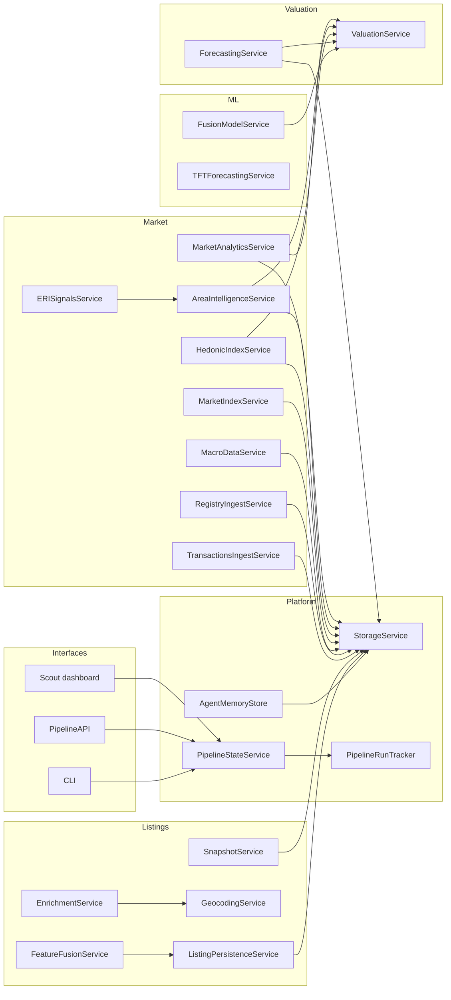
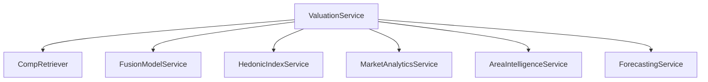

# Services Map

This page is a visual inventory of service classes and their boundaries.

Companion pages:
- `docs/explanation/system_overview.md`
- `docs/explanation/data_pipeline.md`
- `docs/explanation/scraping_architecture.md`

## Service Landscape

## Valuation Composition

## Service Boundaries

Listings services:
- `SnapshotService`: file-backed HTML snapshots.
- `EnrichmentService`: reverse geocode + geohash generation.
- `GeocodingService`: forward geocoding utility.
- `FeatureFusionService`: merges VLM/text sentiment and enrichments.
- `ListingPersistenceService`: upsert policy for `listings`.

Market services:
- `TransactionsIngestService`: sold price/status updates.
- `RegistryIngestService`: official metrics ingestion.
- `MacroDataService`: macro indicators ingestion/normalization.
- `MarketIndexService`: price/rent index generation.
- `HedonicIndexService`: time-safe hedonic index construction.
- `AreaIntelligenceService`: area sentiment/development signals.
- `MarketAnalyticsService`: liquidity/momentum/catch-up metrics.
- `ERISignalsService`: derived liquidity signals from official metrics.

Valuation and forecasting services:
- `ForecastingService`: forward price/rent/yield projections.
- `ValuationService`: comps, indices, model inference, and adjustments.

ML services:
- `FusionModelService`: multimodal pricing model inference API.
- `TFTForecastingService`: time-series forecasting service.

Platform services:
- `StorageService`: DB session/engine lifecycle.
- `PipelineStateService`: freshness checks for listings/indices/models.
- `PipelineRunTracker`: pipeline run metadata in `pipeline_runs`.
- `AgentMemoryStore`: persisted agent run memory in `agent_runs`.

## Interaction Rules

- Services read/write through repositories and `StorageService`, not ad-hoc direct SQL in workflows.
- Listing enrichment/persistence remains isolated from crawler extraction.
- Valuation is strict: missing load-bearing artifacts are explicit failures.
- Market services derive indicators without mutating listing payload semantics.
