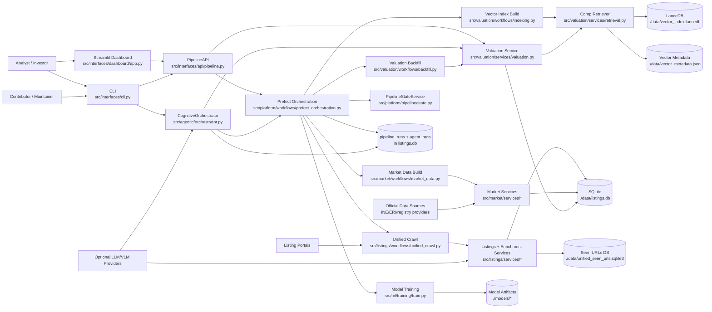

# Architecture

## System Diagram (Current)

## Scope, Constraints, and Quality Scenarios

### Scope

- Local-first end-to-end property intelligence workflow for crawl, enrichment, market data, retrieval, training, and valuation.
- Three aligned interfaces over the same pipeline surface: CLI, dashboard, and Python API.
- Optional agentic orchestration layered on top of deterministic workflows.

### Constraints

- Default persistence is local SQLite plus file artifacts under `data/` and `models/`.
- Crawler reliability is bounded by external anti-bot policies and source volatility.
- LLM/VLM features are optional and must fail safely without corrupting core flows.
- No CI workflow currently exists, so runtime and docs gates are local/manual.

### Quality scenarios

- QS-01 Freshness:
  - Stimulus: user starts dashboard or runs `preflight`.
  - Response: stale/missing artifacts are detected and only required refresh steps run.
  - Evidence: `src/platform/pipeline/state.py`, `src/platform/workflows/prefect_orchestration.py`.
- QS-02 Deterministic offline validation:
  - Stimulus: maintainer runs default tests.
  - Response: offline unit/integration/e2e suites are selectable and reproducible.
  - Evidence: `pytest.ini`, `tests/conftest.py`, `docs/manifest/10_testing.md`.
- QS-03 Time-safe valuation:
  - Stimulus: valuation request for listing X.
  - Response: retriever/time filters avoid future leakage; insufficient comps fail explicitly.
  - Evidence: `src/valuation/services/retrieval.py`, `src/valuation/services/valuation.py`.
- QS-04 Partial failure containment:
  - Stimulus: one workflow step fails (crawl/market/index/train/backfill).
  - Response: failure is recorded in `pipeline_runs`; subsequent diagnosis is possible.
  - Evidence: `src/platform/pipeline/repositories/pipeline_runs.py`, `src/platform/workflows/prefect_orchestration.py`.
- QS-05 Contract coherence:
  - Stimulus: command surface changes.
  - Response: CLI/API/flow contracts remain traceable and docs are updated in same packet.
  - Evidence: `src/interfaces/cli.py`, `src/interfaces/api/pipeline.py`, this manifest set.
- QS-06 Bounded local operation:
  - Stimulus: developer runs all core flows on one machine.
  - Response: workflows complete without requiring distributed infra.
  - Evidence: `README.md`, `run_dashboard.sh`, `src/platform/config.py`.

## C4-1 System Context

| Actor / External System | Relationship to Property Scanner | Interface / Boundary |
| --- | --- | --- |
| Analyst / Investor | Runs dashboard/CLI and interprets outputs | `src/interfaces/dashboard/app.py`, `src/interfaces/cli.py` |
| Contributor / Maintainer | Evolves code, tests, and docs | `tests/`, `docs/`, `src/` |
| Listing portals | Source of listing/raw content | `src/listings/agents/crawlers/*`, `src/listings/workflows/unified_crawl.py` |
| Official metrics providers | Source of macro/registry signals | `src/listings/agents/crawlers/spain/official_sources.py`, `src/market/services/registry_ingest.py` |
| Optional LLM/VLM providers | Optional enrichment/reasoning | `src/platform/utils/llm.py`, `src/listings/services/vlm.py`, `src/agentic/*` |
| Local filesystem + DB | Persistence boundary | `data/`, `models/`, `src/platform/storage.py` |

## C4-2 Containers

| Container | Responsibility | Tech / Runtime | Evidence Paths |
| --- | --- | --- | --- |
| Interfaces | User entrypoints and orchestration trigger | Python, argparse, Streamlit | `src/interfaces/cli.py`, `src/interfaces/dashboard/app.py`, `src/interfaces/api/pipeline.py` |
| Agentic orchestration | Adaptive reasoning workflow and tool routing | LangGraph/LangChain | `src/agentic/orchestrator.py`, `src/agentic/graph.py`, `src/agentic/tools.py` |
| Workflow orchestrator | Task retries, preflight sequencing, run tracking | Prefect + custom state policy | `src/platform/workflows/prefect_orchestration.py`, `src/platform/pipeline/state.py` |
| Listings ingestion | Crawl, normalize, quality gate, persistence | Scrapers + domain services | `src/listings/workflows/unified_crawl.py`, `src/listings/services/*` |
| Market intelligence | Macro/registry/hedonic/analytics pipelines | Services + repositories | `src/market/workflows/market_data.py`, `src/market/services/*`, `src/market/repositories/*` |
| Valuation + retrieval | Comp retrieval, valuation synthesis, persistence | LanceDB + valuation services | `src/valuation/workflows/*`, `src/valuation/services/*` |
| ML training | Model training and optional captioning | PyTorch/ML stack | `src/ml/training/train.py`, `src/ml/training/image_captioning.py` |
| Persistence | SQL schema + migrations + artifact paths | SQLite/SQLAlchemy/filesystem | `src/platform/domain/models.py`, `src/platform/migrations.py`, `src/platform/config.py` |

## C4-3 Components

### High-risk container: Valuation + Retrieval

| Component | Responsibility | Input / Output Contract | Evidence |
| --- | --- | --- | --- |
| `ValuationService` | End-to-end deal valuation + evidence pack | `CanonicalListing` -> `DealAnalysis` | `src/valuation/services/valuation.py` |
| `CompRetriever` | Similarity retrieval with geo/time filters | Listing query -> `CompListing[]` | `src/valuation/services/retrieval.py` |
| `ForecastingService` | Forward projections for horizons | Market/index inputs -> projections | `src/valuation/services/forecasting.py` |
| `ValuationPersister` | Persist valuation snapshots | `DealAnalysis` -> `valuations` table | `src/valuation/services/valuation_persister.py` |
| `HedonicIndexService` + market services | Time-adjustment and market context | DB market tables -> adjustments/signals | `src/market/services/hedonic_index.py`, `src/market/services/market_analytics.py` |

### High-risk container: Unified Crawl + Enrichment

| Component | Responsibility | Input / Output Contract | Evidence |
| --- | --- | --- | --- |
| `UnifiedCrawlRunner` | Source plan execution + dedupe + persistence | source plans -> canonical listings persisted | `src/listings/workflows/unified_crawl.py` |
| `AgentFactory` + crawlers | Source-specific extraction | URL/path -> `RawListing[]` | `src/listings/agents/factory.py`, `src/listings/agents/crawlers/*` |
| `ListingQualityGate` | Reject invalid records before storage | listing -> valid/invalid reasons | `src/listings/services/quality_gate.py` |
| `FeatureFusionService` + VLM | Optional multimodal enrichment | canonical listing -> enriched listing | `src/listings/services/feature_fusion.py`, `src/listings/services/vlm.py` |
| `ListingPersistenceService` | Batch storage into repository | canonical listing batch -> DB rows | `src/listings/services/listing_persistence.py` |

## Runtime Scenarios

### Scenario 1: Preflight refresh (happy path)

1. User runs `python3 -m src.interfaces.cli preflight`.
2. CLI delegates to `src.platform.workflows.prefect_orchestration`.
3. `PipelineStateService.snapshot()` computes stale/missing signals.
4. Required steps execute in order: crawl -> transactions -> market data -> index -> training.
5. Step outcomes are tracked in `pipeline_runs`.
6. Updated artifacts are visible to dashboard/API.

Evidence: `src/interfaces/cli.py`, `src/platform/workflows/prefect_orchestration.py`, `src/platform/pipeline/state.py`, `src/platform/pipeline/repositories/pipeline_runs.py`.

### Scenario 2: Dashboard valuation read path

1. User opens Streamlit dashboard and filters listings.
2. Dashboard services load rows from storage and current pipeline status.
3. Selected listing is evaluated through valuation service path (directly or via API wrappers).
4. Result with comps/evidence is rendered in dashboard components.

Evidence: `src/interfaces/dashboard/app.py`, `src/interfaces/dashboard/services/loaders.py`, `src/interfaces/api/pipeline.py`, `src/valuation/services/valuation.py`.

### Scenario 3: Failure path (insufficient comps / stale retrieval artifacts)

1. Valuation request hits `CompRetriever`.
2. If candidates are insufficient or metadata mismatch occurs, fallback DB retrieval is attempted.
3. If fallback is still insufficient, valuation fails explicitly (`insufficient_comps`) and is logged.
4. Backfill workflow skips failed listing and continues remaining work.

Evidence: `src/valuation/services/retrieval.py`, `src/valuation/services/valuation.py`, `src/valuation/workflows/backfill.py`.

## Deployment and Trust Boundaries

### Deployment views

- Local host mode (default):
  - Python process + local files/SQLite.
  - Evidence: `README.md`, `run_dashboard.sh`, `src/platform/config.py`.
- Containerized mode (optional):
  - Docker image with dashboard service on port `8505`.
  - Optional PostgreSQL service declared in compose but not default runtime.
  - Evidence: `Dockerfile`, `docker-compose.yml`.

### Trust boundaries

- TB-01 Local trusted boundary:
  - Repo code, local DB/files, local model artifacts.
- TB-02 External untrusted content boundary:
  - Listing portal HTML/data and downloadable assets.
  - Guarding components: crawl compliance, quality gate, sanitizers.
- TB-03 External model/provider boundary:
  - Optional LLM/VLM providers and API credentials.
  - Guarding components: config isolation, optional execution paths, safe fallback.

## Cross-Cutting Concepts

- Security and compliance:
  - User-agent/compliance controls and source restrictions.
  - Evidence: `src/platform/utils/compliance.py`, `config/sources.yaml`.
- Observability:
  - Structured logs + persisted run metadata (`pipeline_runs`, `agent_runs`).
  - Evidence: `src/platform/pipeline/repositories/pipeline_runs.py`, `src/agentic/memory.py`.
- Reliability:
  - Prefect retries, idempotent migrations, explicit failure/skip handling.
  - Evidence: `src/platform/workflows/prefect_orchestration.py`, `src/platform/migrations.py`.
- Data consistency and correctness:
  - Canonical schema enforcement and repository-backed access.
  - Evidence: `src/platform/domain/schema.py`, `src/platform/domain/models.py`, `src/listings/repositories/listings.py`.
- Reproducibility:
  - Config-driven paths and persisted metadata for retrieval/model artifacts.
  - Evidence: `config/app.yaml`, `src/platform/settings.py`, `src/valuation/services/retrieval.py`.

## Risks and Technical Debt

- R-01 No CI gate:
  - Impact: regressions can land without automated cross-platform checks.
  - Evidence: `docs/manifest/11_ci.md`.
- R-02 Dual persistence posture (SQLite default vs compose Postgres):
  - Impact: environment drift risk if contributors assume different DB backends.
  - Evidence: `src/platform/config.py`, `docker-compose.yml`.
- R-03 Architecture docs previously missing in manifest system:
  - Impact: implementation can drift without checkable C4 baseline.
  - Mitigation: this prompt packet establishes `docs/manifest/01_architecture.md` and coherence checklist.
- R-04 Retriever/model metadata coupling:
  - Impact: stale index/metadata can degrade valuation trust.
  - Evidence: strict model/metadata checks in `src/valuation/services/retrieval.py`.
- R-05 Release discipline artifacts missing:
  - Impact: readiness and compatibility policy are not yet explicit.
  - Follow-up: `prompt-11-docs-diataxis-release` packet.
